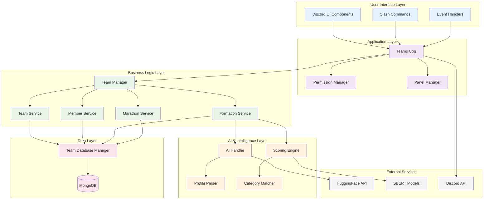

# Complete Workflow Summary - Discord Team Management Bot

## Project Overview

The Discord Team Management Bot is a sophisticated multi-component system that orchestrates intelligent team formation and management within The Betterment Discord server. This document serves as the comprehensive orchestrator, providing a high-level view of how all system components work together to deliver seamless team management capabilities.

## System Architecture Overview

The bot follows a **layered microservice architecture** with clear separation of concerns:



## Core System Components

### 1. Database Architecture ([03-database-architecture.md](docs/03-database-architecture.md))

**MongoDB Document-Oriented Design** with four primary collections:

- **Teams Collection**: Embedded member documents for optimal query performance
- **Team Panels Collection**: Persistent UI state management
- **Unregistered Members Collection**: Staging area with leader/member segregation
- **Marathon State Collection**: Global event state management

**Key Features**:
- Strategic indexing for O(log n) performance
- Atomic operations ensuring data consistency
- Flexible schema supporting complex team hierarchies
- Connection pooling with automatic retry logic

### 2. Teams Cog Architecture ([04-teams-cog-overview.md](docs/04-teams-cog-overview.md))

**Central orchestration layer** implementing modular architecture:

```
cogs/teams/
├── cog.py              # Command definitions & lifecycle
├── permissions.py      # Role-based access control
├── panel_management.py # UI state management
├── services/           # Business logic layer
├── ui/                # Discord interaction components
└── utils/             # Utility functions
```

**Responsibilities**:
- Command registration and routing
- Event handling and state management
- Service layer coordination
- Error propagation and recovery

### 3. Command System ([05-slash-commands-workflow.md](docs/05-slash-commands-workflow.md))

**Six primary slash commands** with hierarchical permission system:

| Command | Purpose | Permission Level |
|---------|---------|-----------------|
| `/panel` | Creates team management interface | Moderator |
| `/create_team` | Creates new teams with validation | Moderator |
| `/add_members` | Adds members to existing teams | Moderator |
| `/sync` | Manual database synchronization | Moderator |
| `/manual_save` | Profile data management | Moderator |
| `/marathon_status` | Marathon state management | Moderator |

**Workflow Pattern**:
1. Permission validation via `@moderator_required`
2. Input validation and sanitization
3. Business logic delegation to service layer
4. Response formatting with contextual error handling
5. UI state refresh and user feedback

### 4. UI Component System ([06-ui-components-workflow.md](docs/06-ui-components-workflow.md))

**Three-tier component architecture**:

- **Views**: Container components with dropdown selections
- **Buttons**: Action triggers with centralized error handling
- **Modals**: Form input dialogs with validation

**Interaction Flow**:
```
MainPanelView → Action Buttons → Confirmation/Selection → Modal Input → Service Execution → Panel Refresh
```

**Key Patterns**:
- Persistent views for main interface (no timeout)
- Temporary views for specific workflows (300s timeout)
- Circular import avoidance through local imports
- Post-action component disabling for user experience

### 5. Button Workflow System ([07-button-workflows-detailed.md](docs/07-button-workflows-detailed.md))

**Hierarchical button architecture** with `TeamButton` base class:

**Main Panel Buttons (Row 0)**:
- `ViewTeamButton`: Team selection interface
- `DeleteTeamButton`: Team deletion initiation
- `ReflectButton`: Data analysis and formation gateway

**Main Panel Buttons (Row 1)**:
- `StartMarathonButton`: Resource provisioning
- `EndMarathonButton`: Resource cleanup
- `RefreshButton`: Simple data synchronization
- `FetchDataButton`: Server discovery

**Common Patterns**:
- Deferred responses for long operations
- Comprehensive validation before execution
- Detailed result reporting with categorized feedback
- Automatic panel refresh after state changes

### 6. AI Profile Processing ([08-ai-profile-processing.md](docs/08-ai-profile-processing.md))

**Sophisticated NLP pipeline** for profile data extraction:

**Components**:
- **AIHandler**: HuggingFace API orchestration
- **ProfileParser**: Message-based processing workflow
- **SimilarityCalculator**: SBERT-based semantic comparison
- **Category Taxonomy**: Structured interest classification

**Processing Pipeline**:
1. Message content extraction and validation
2. Dynamic prompt generation with taxonomy integration
3. LLM API call with retry logic and error handling
4. JSON response parsing and data cleaning
5. Database storage with role-based segregation
6. User feedback through reactions and messages

**Output Structure**:
```json
{
    "timezone": "EST",
    "habits": ["coding", "reading", "hiking"],
    "goals": ["learn ML", "build startup", "improve leadership"],
    "category": {
        "technology_and_computing": ["software_and_web_dev", "emerging_tech_and_ai"],
        "business_and_finance": ["business_strategy"]
    }
}
```

### 7. Team Formation Algorithm ([09-team-formation-algorithm.md](docs/09-team-formation-algorithm.md))

**4-Phase Hierarchical Clustering Algorithm**:

#### Phase 1: Timezone Clustering
- Groups members by UTC offset compatibility
- Hard constraint ensuring collaboration feasibility
- Null timezone handling for incomplete profiles

#### Phase 2: Category Clustering
- Leader-centric clustering using interest domain similarity
- Threshold-based assignment with orphan generation
- Jaccard-like similarity with domain weighting

#### Phase 3: Semantic Optimization
- SBERT-based semantic similarity analysis
- Cohesion ranking for oversized team optimization
- Preserves leaders while optimizing member composition

#### Phase 4: Orphan Reassignment
- Tiered assignment logic with fallback mechanisms
- Timezone preference with category optimization
- Capacity-aware assignment preventing overflow

**Algorithm Complexity**: O(n × l + Σk³ + o × t) where:
- n = total members, l = leaders per timezone
- k = oversized team members, o = orphans, t = teams

## Data Flow Architecture

### Primary Data Flows

#### 1. Team Creation Flow
```
User Input → Command Validation → Member Parsing → Marathon State Check →
Database Insertion → Discord Resource Creation → Panel Refresh → User Feedback
```

#### 2. Profile Processing Flow
```
Message Reaction → Content Extraction → AI Processing → Data Structuring →
Database Storage → User Feedback → Formation Algorithm Integration
```

#### 3. Team Formation Flow
```
Reflection Trigger → Data Synchronization → Unassigned Member Analysis →
Algorithm Execution → Results Presentation → Batch Team Creation → State Update
```

#### 4. Marathon Management Flow
```
State Change Request → Current State Validation → Resource Provisioning/Cleanup →
Database State Update → Detailed Result Reporting → Panel State Refresh
```

### State Management Strategy

**Multi-Layer State Persistence**:
1. **Database State**: Persistent team and member data
2. **UI State**: Active panels and interaction components
3. **Session State**: Temporary workflow data
4. **Marathon State**: Global operational mode

**Consistency Mechanisms**:
- Atomic database operations prevent partial updates
- UI refresh after all state-changing operations
- Validation checkpoints throughout workflows
- Error recovery with state rollback capabilities

## Integration Patterns

### Service Layer Integration

**Dependency Injection Pattern**:
```python
class TeamsCog:
    def __init__(self, bot):
        self.team_manager = TeamManager(bot.db)
        self.ai_handler = AIHandler()
        self.marathon_service = MarathonService(self)
        # Centralized dependency management
```

**Service Orchestration**:
- TeamManager coordinates multiple service calls
- Services maintain single responsibility principle
- Database operations abstracted through manager layer
- Error handling propagated with context preservation

### External API Integration

**HuggingFace API**:
- Async execution preventing Discord interaction blocking
- Exponential backoff retry logic for transient failures
- Response validation and sanitization
- Token-based authentication with environment configuration

**Discord API**:
- Event-driven architecture for real-time synchronization
- Permission-aware operations with graceful degradation
- Rate limiting compliance through built-in client handling
- Webhook-based persistent UI management

## Error Handling and Recovery

### Multi-Level Error Strategy

#### 1. Component Level
- Specific error types with contextual messages
- Input validation with user-friendly feedback
- State validation before operations

#### 2. Service Level
- Business logic error propagation with context
- Transaction rollback on critical failures
- Resource cleanup on partial operations

#### 3. System Level
- Global exception handlers for unhandled errors
- Logging with stack traces for debugging
- Graceful degradation with reduced functionality

#### 4. User Level
- Clear error messages with actionable guidance
- Ephemeral responses preventing channel clutter
- Contextual help based on current operation

### Recovery Mechanisms

**Automatic Recovery**:
- Database connection retry with exponential backoff
- Stale UI component cleanup on restart
- State synchronization on panel refresh

**Manual Recovery**:
- `/sync` command for database-Discord reconciliation
- Panel recreation for corrupted UI state
- Marathon state reset for stuck operations

## Performance and Scalability

### Optimization Strategies

#### Database Performance
- Compound indexing for common query patterns
- Embedded documents reducing join operations
- Connection pooling preventing resource exhaustion
- Query optimization through service layer abstraction

#### AI Processing Performance
- Global model caching preventing redundant loading
- Async execution maintaining Discord responsiveness
- Batch processing for multiple profile operations
- Lazy loading minimizing memory footprint

#### UI Performance
- Persistent views reducing recreation overhead
- Component disabling preventing duplicate actions
- Efficient state management through centralized refresh
- Minimal database queries through smart caching

### Scalability Considerations

**Current Capacity**: Optimized for 100-200 concurrent members per server
**Bottlenecks**: Semantic similarity calculations during team formation
**Mitigation**: Async processing with progress feedback for large operations

## Security and Privacy

### Permission Management
- Role-based access control with Discord integration
- Command-level permission validation
- Operation-specific authorization checks
- Audit logging for administrative actions

### Data Protection
- User data minimization with profile-only storage
- No persistent message content storage
- Automatic cleanup of temporary data
- Environment-based sensitive configuration

## Deployment and Maintenance

### Configuration Management
- Environment variables for sensitive data
- Configuration classes for operational parameters
- Database connection string management
- API token configuration with validation

### Monitoring and Logging
- Structured logging with contextual information
- Error tracking with stack trace preservation
- Performance metrics for optimization
- User action auditing for troubleshooting

### Backup and Recovery
- Automated database backups with timestamp metadata
- Export functionality for data migration
- State recovery procedures for system restoration
- Disaster recovery documentation

## Usage Workflows

### For Server Administrators

#### Initial Setup
1. Invite bot with necessary permissions
2. Configure moderator roles in settings
3. Create initial team management panel with `/panel`
4. Set up communication channel for profile processing

#### Daily Operations
1. Monitor team formation through reflection reports
2. Manually create teams as needed with `/create_team`
3. Process member assignments based on AI recommendations
4. Manage marathon state transitions for events

#### Maintenance Tasks
1. Periodic database synchronization with `/sync`
2. Panel refresh for UI state consistency
3. Monitor system performance and error logs
4. Review and clean up inactive teams

### For Team Members

#### Profile Setup
1. Write introduction message in designated channel
2. Add reaction to trigger AI processing
3. Verify extracted profile data accuracy
4. Update profile through additional messages

#### Team Participation
1. Wait for team assignment through formation algorithm
2. Participate in team activities and channels
3. Update profile data as interests evolve
4. Provide feedback on team compatibility

### For Moderators

#### Team Management
1. Use UI components for intuitive team operations
2. Monitor team health through reflection reports
3. Manually assign members based on special requirements
4. Manage team resources during marathon events

#### Troubleshooting
1. Use synchronization commands for data consistency
2. Manually save profile data when AI fails
3. Recreate UI panels when corruption occurs
4. Escalate technical issues to administrators

## Future Enhancement Opportunities

### Algorithm Improvements
- Machine learning-based parameter optimization
- Historical performance analysis for algorithm tuning
- Multi-objective optimization for complex team requirements
- Real-time feedback integration for continuous improvement

### User Experience Enhancements
- Advanced filtering and search capabilities
- Predictive team recommendations
- Interactive team formation workflows
- Mobile-optimized interface components

### Integration Expansions
- Calendar integration for timezone coordination
- Project management tool connections
- Skill assessment system integration
- Performance tracking and analytics

### Scalability Improvements
- Distributed processing for large-scale operations
- Caching layer for frequently accessed data
- Load balancing for high-concurrency scenarios
- Database sharding for multi-server deployments

## Documentation Navigation

This summary orchestrates the following detailed documentation:

- **[Database Architecture](docs/03-database-architecture.md)**: MongoDB schema and data management
- **[Teams Cog Overview](docs/04-teams-cog-overview.md)**: Core application architecture
- **[Slash Commands Workflow](docs/05-slash-commands-workflow.md)**: Command system implementation
- **[UI Components Workflow](docs/06-ui-components-workflow.md)**: Interactive interface design
- **[Button Workflows Detailed](docs/07-button-workflows-detailed.md)**: User action handling
- **[AI Profile Processing](docs/08-ai-profile-processing.md)**: Intelligent data extraction
- **[Team Formation Algorithm](docs/09-team-formation-algorithm.md)**: Clustering and optimization

Each document provides deep technical detail while this summary maintains the high-level orchestration view necessary for understanding the complete system architecture and operational workflows.

---

*This Discord Team Management Bot represents a sophisticated integration of modern technologies including AI/ML, distributed systems, real-time communication, and intelligent algorithms to solve the complex problem of optimal team formation in collaborative environments.*
# Betterment1

# Betterment1

