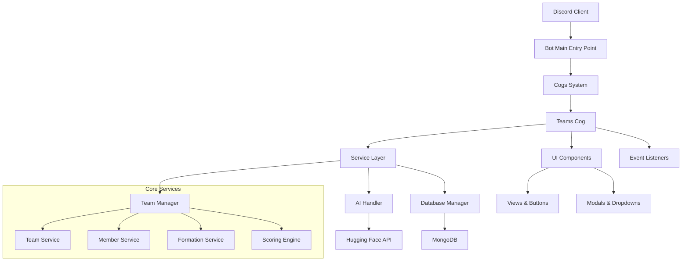

# Bot Overview

## Project Purpose and Core Functionality

The Discord Team Management Bot is a sophisticated application designed to automate team formation and management within The Betterment Discord Server. The bot leverages AI-powered profile analysis to intelligently match members based on their skills, interests, timezones, and availability, creating balanced and compatible teams for various projects or activities.

### Core Features
- **AI-Powered Profile Analysis**: Uses Hugging Face models to extract and categorize member skills and interests
- **Intelligent Team Formation**: Automated team creation based on compatibility scoring algorithms
- **Interactive UI Components**: Rich Discord interface with buttons, modals, and select menus
- **Team Management**: CRUD operations for teams with role-based permissions
- **Marathon Mode**: Special event handling for time-bound team formation activities
- **Member Assignment**: Manual and automated assignment of unregistered members to teams

## High-Level Architecture



## Technology Stack

### Core Framework
- **Discord.py 2.x**: Modern async Discord bot framework with slash commands support
- **Python 3.10+**: Leveraging modern Python features and type hints
- **Motor**: Async MongoDB driver for database operations

### External Services
- **MongoDB**: Primary database for persistent storage
- **Hugging Face API**: AI model integration for profile analysis
- **Flask**: Web server for health checks and potential webhook endpoints

### Key Dependencies
- `discord.py`: Discord API interaction
- `motor`: Async MongoDB operations
- `aiohttp`: HTTP client for AI API calls
- `python-dotenv`: Environment variable management
- `logging`: Comprehensive application logging

## System Requirements

### Runtime Environment
- Python 3.10 or higher
- MongoDB database instance
- Discord Bot Token with appropriate permissions
- Hugging Face API access token

### Discord Permissions Required
- Send Messages
- Use Slash Commands
- Manage Roles (for team role assignment)
- Read Message History
- Add Reactions
- Embed Links

### Environment Variables
```env
DISCORD_TOKEN=your_bot_token
MONGO_URI=mongodb://connection_string
DB_NAME=Betterment
HUGGINGFACE_API_TOKEN=your_hf_token
HUGGINGFACE_MODEL=deepseek-ai/DeepSeek-V3-0324
MODERATOR_ROLES=Admin,Moderator
MAX_TEAM_SIZE=12
MAX_LEADERS_PER_TEAM=2
```

## Security and Permissions Model

### Role-Based Access Control
The bot implements a hierarchical permission system:

1. **Moderators**: Full access to all team management functions
   - Create/delete teams
   - Force assign members
   - Access administrative panels

2. **Team Leaders**: Limited management within their teams
   - Manage team members
   - Update team information
   - Access team-specific functions

3. **Regular Members**: Basic interaction capabilities
   - Join/leave teams
   - View team information
   - Participate in team activities

### Security Features
- **Input Validation**: All user inputs are sanitized and validated
- **Rate Limiting**: Bot implements cooldowns on commands to prevent abuse
- **Error Handling**: Comprehensive error catching with user-friendly messages
- **Audit Logging**: All significant actions are logged for administrative review

### Data Protection
- **Minimal Data Collection**: Only necessary profile information is stored
- **Secure Storage**: MongoDB with proper connection encryption
- **Data Retention**: Configurable cleanup of old team and member data
- **Privacy Controls**: Members can request data deletion or modification

## Deployment Considerations

### Scalability
- Async architecture supports high concurrent load
- Database operations are optimized with proper indexing
- Stateless design allows for horizontal scaling

### Monitoring
- Comprehensive logging system for debugging and monitoring
- Health check endpoint via Flask web server
- Database connection monitoring and retry logic

### Maintenance
- Modular cog system allows for hot-reloading of components
- Configuration management through environment variables
- Database migration support for schema updates
