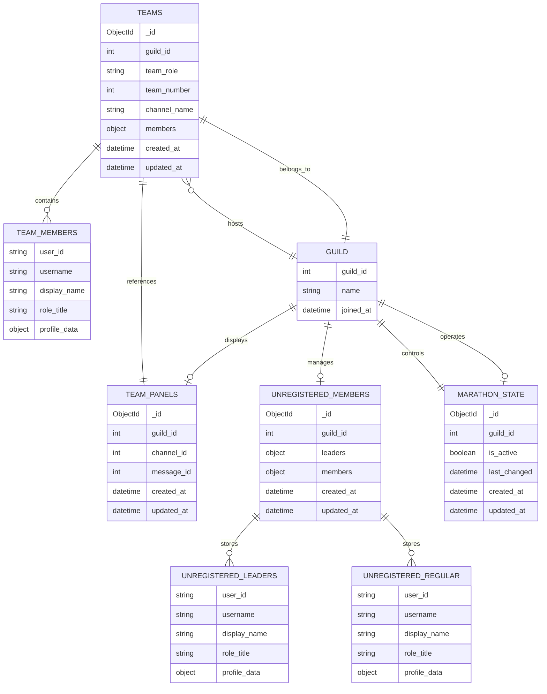

# Database Architecture

## Overview

The Discord team management bot utilizes MongoDB as its primary database management system, implementing a document-oriented approach that provides flexibility for complex team hierarchies and member relationships. The architecture is built around the `TeamDatabaseManager` class, which serves as the central data access layer, providing asynchronous CRUD operations and specialized business logic for team management workflows.

The database design emphasizes performance through strategic indexing, atomic operations for data consistency, and a modular approach that separates concerns between different entity types while maintaining referential integrity through well-defined relationships.

## Database Schema Design and Relationships

### Core Collections

The database consists of four primary collections, each serving distinct functional domains within the team management ecosystem:

#### 1. Teams Collection (`teams`)

The teams collection serves as the primary repository for team data, storing comprehensive information about team composition, metadata, and member relationships. Each document represents a complete team entity with embedded member data for optimal query performance.

```javascript
{
  "_id": ObjectId,
  "guild_id": 1375913075491737670,           // Discord server identifier
  "team_number": 1,                          // Sequential team numbering
  "team_role": "Team 1",                     // Discord role name
  "channel_name": "team-1",                  // Associated Discord channel
  "members": {                               // Embedded member documents
    "589425101833895936": {
      "user_id": "589425101833895936",
      "username": "ghost4404",
      "display_name": "Ghost",
      "role_title": "Team Leader",
      "profile_data": {                       // Extensible profile information
        "timezone": "EST",
        "goals": [
          "win a coding competition",
          "become a full stack dev"
        ],
        "habits": [
          "debugging code",
          "frontend design",
          "hackathons"
        ],
        "category": {
          "technology_and_computing": [
            "software_and_web_dev"
          ]
        }
      }
    },
    "1109085483939676212": {
      "user_id": "1109085483939676212",
      "username": "ryo",
      "display_name": "𝐑 𝐘 𝐎",
      "role_title": "Team Member",
      "profile_data": {}
    }
  },
  "created_at": ISODate("2024-01-15T10:30:00Z"),
  "updated_at": ISODate("2024-01-20T14:45:00Z")
}
```

**Design Rationale**: The embedded member structure eliminates the need for complex joins while maintaining data locality, enabling efficient single-query team retrievals with full member information.

#### 2. Team Panels Collection (`team_panels`)

This collection maintains references to Discord message objects that serve as interactive team management interfaces, enabling persistent UI state management across bot restarts.

```javascript
{
  "_id": ObjectId,
  "guild_id": 1375913075491737670,
  "channel_id": 987654321,                   // Discord channel containing the panel
  "message_id": 111222333,                   // Discord message ID for the panel
  "created_at": ISODate("2024-01-15T10:30:00Z"),
  "updated_at": ISODate("2024-01-20T14:45:00Z")
}
```

**Constraint**: One team panel per guild, enforced through unique indexing on `guild_id`.

#### 3. Unregistered Members Collection (`unregistered_members`)

This collection implements a staging area for users who have expressed interest in team participation but haven't been assigned to specific teams. The design segregates leaders and members for efficient role-based queries and team formation algorithms.

```javascript
{
  "_id": ObjectId,
  "guild_id": 1375913075491737670,
  "leaders": {                               // Potential team leaders
    "475720636782608385": {
      "username": "luna2323",
      "display_name": "Luna",
      "role_title": "Team Leader",
      "profile_data": {}
    }
  },
  "members": {                               // General team members
    "398765432109876543": {
      "username": "alex_dev",
      "display_name": "Alex",
      "role_title": "Team Member",
      "profile_data": {}
    }
  },
  "created_at": ISODate("2024-01-15T10:30:00Z"),
  "updated_at": ISODate("2024-01-20T14:45:00Z")
}
```

**Design Benefits**: The segregated structure enables efficient team formation algorithms by allowing direct access to leadership candidates without scanning through all unregistered members.

#### 4. Marathon State Collection (`marathon_state`)

This collection manages the global state of marathon events, which alter team management behavior, registration workflows, and resource provisioning logic.

```javascript
{
  "_id": ObjectId,
  "guild_id": 1375913075491737670,
  "is_active": false,                        // Marathon mode toggle
  "last_changed": ISODate("2024-01-20T09:15:00Z"),
  "created_at": ISODate("2024-01-15T10:30:00Z"),
  "updated_at": ISODate("2024-01-20T14:45:00Z")
}
```

**State Impact**: When `is_active` is true, the system modifies team creation workflows, enables automatic Discord resource provisioning, and alters member validation logic.

## TeamDatabaseManager Class Architecture

### Initialization and Connection Management

```python
class TeamDatabaseManager:
    def __init__(self, uri: str, db_name: str = DB_NAME):
        self.client = AsyncIOMotorClient(uri)
        self.db = self.client[db_name]
        self.teams = self.db[TEAMS_COLLECTION]
        self.team_panels = self.db[TEAM_PANELS_COLLECTION]
        self.unregistered = self.db[UNREGISTERED_MEMBERS_COLLECTION]
        self.marathon_state = self.db[MARATHON_STATE_COLLECTION]
```

The manager utilizes Motor's async MongoDB driver, which provides:
- **Automatic Connection Pooling**: Handles concurrent operations efficiently
- **Non-blocking I/O**: Prevents bot command blocking during database operations
- **Built-in Retry Logic**: Manages transient network failures
- **Resource Optimization**: Automatic connection lifecycle management

### Generic CRUD Operations Layer

The manager implements a generic operations layer that provides consistent patterns across all collections:

```python
async def _update_document(self, collection, filter_query: Dict, update_data: Dict, upsert: bool = False):
    """Generic method to update a single document with automatic timestamp management."""
    update_query = {"$set": {**update_data, "updated_at": datetime.utcnow()}}
    return await collection.update_one(filter_query, update_query, upsert=upsert)

async def _find_document(self, collection, filter_query: Dict) -> Optional[Dict[str, Any]]:
    """Generic method to find a single document with consistent error handling."""
    return await collection.find_one(filter_query)
```

**Benefits**:
- **Consistent Timestamp Management**: All updates automatically receive timestamp metadata
- **Standardized Error Handling**: Uniform exception patterns across operations
- **Code Reusability**: Reduces duplication across specialized methods
- **Maintainability**: Centralized logic for common database patterns

## Specialized Database Operations

### Team Management Operations

#### Team Retrieval and Creation
```python
async def get_team_by_name(self, guild_id: int, team_name: str) -> Optional[Dict[str, Any]]:
    """Retrieves a specific team using compound indexing for optimal performance."""
    return await self._find_document(self.teams, {"guild_id": guild_id, "team_role": team_name})

async def insert_team(self, team_data: Dict[str, Any]):
    """Creates a new team with automatic metadata injection."""
    team_data.update({
        "created_at": datetime.utcnow(),
        "updated_at": datetime.utcnow()
    })
    return await self.teams.insert_one(team_data)
```

#### Advanced Team Queries
```python
async def get_max_team_number(self, guild_id: int) -> int:
    """Efficiently determines the next available team number using descending sort."""
    highest_team = await self.teams.find_one(
        {"guild_id": guild_id},
        sort=[("team_number", -1)]
    )
    return highest_team.get("team_number", 0) if highest_team else 0
```

**Query Optimization**: This method uses MongoDB's native sorting to retrieve only the highest team number, avoiding expensive aggregation operations.

### Member Management Operations

#### Cross-Team Member Updates
```python
async def update_member_in_teams(self, guild_id: int, user_id: str, updates: Dict[str, Any]):
    """Updates member information across all teams they participate in."""
    filter_query = {"guild_id": guild_id, f"members.{user_id}": {"$exists": True}}
    update_data = {f"members.{user_id}.{k}": v for k, v in updates.items()}
    return await self._update_many_documents(self.teams, filter_query, update_data)
```

**Design Pattern**: This operation demonstrates the embedded document approach's power, enabling atomic updates across multiple team documents where a member exists.

#### Team Discovery by Member
```python
async def find_team_by_member(self, guild_id: int, user_id: str) -> Optional[dict]:
    """Locates the team containing a specific member using existence queries."""
    return await self._find_document(
        self.teams,
        {"guild_id": guild_id, f"members.{user_id}": {"$exists": True}}
    )
```

### Unregistered Member Operations

#### Atomic Role Transitions
```python
async def move_unregistered_member_role(self, guild_id: int, user_id: str, from_type: str, to_type: str):
    """Atomically moves a member between role categories within the unregistered collection."""
    # Retrieve current member data
    unregistered_doc = await self.get_unregistered_document(guild_id)
    if not unregistered_doc or user_id not in unregistered_doc.get(from_type, {}):
        return False

    member_data = unregistered_doc[from_type][user_id]

    # Perform atomic move operation
    update_pipeline = {
        "$set": {f"{to_type}.{user_id}": member_data, "updated_at": datetime.utcnow()},
        "$unset": {f"{from_type}.{user_id}": ""}
    }

    result = await self.unregistered.update_one({"guild_id": guild_id}, update_pipeline)
    return result.modified_count > 0
```

**Atomicity Guarantee**: This operation ensures data consistency by performing both the addition and removal in a single database transaction, preventing intermediate states.

#### Bulk Member Removal
```python
async def remove_unregistered_member(self, guild_id: int, user_id: str):
    """Removes a user from both leader and member categories in a single operation."""
    return await self.unregistered.update_one(
        {"guild_id": guild_id"},
        {
            "$unset": {f"leaders.{user_id}": "", f"members.{user_id}": ""},
            "$set": {"updated_at": datetime.utcnow()}
        }
    )
```

### Marathon State Management

#### State Retrieval with Defaults
```python
async def get_marathon_state(self, guild_id: int) -> bool:
    """Retrieves marathon state with safe default handling."""
    state_doc = await self._find_document(self.marathon_state, {"guild_id": guild_id})
    return state_doc.get("is_active", False) if state_doc else False
```

#### Atomic State Updates
```python
async def set_marathon_state(self, guild_id: int, is_active: bool) -> bool:
    """Updates marathon state with upsert capability for initialization."""
    state_data = {
        "is_active": is_active,
        "last_changed": datetime.utcnow()
    }

    result = await self._update_document(
        self.marathon_state,
        {"guild_id": guild_id},
        state_data,
        upsert=True
    )
    return result.modified_count > 0 or result.upserted_id is not None
```

## Entity Relationships



## Query Optimization and Performance

### Indexing Strategy

#### Primary Indexes
```javascript
// Teams Collection - Primary lookup patterns
db.teams.createIndex({ "guild_id": 1, "team_role": 1 }, { unique: true, name: "guild_team_unique" })
db.teams.createIndex({ "guild_id": 1, "team_number": 1 }, { name: "guild_team_number" })

// Member lookup optimization for embedded documents
db.teams.createIndex({ "guild_id": 1, "members.user_id": 1 }, { sparse: true, name: "guild_member_lookup" })

// Team Panels - One per guild constraint
db.team_panels.createIndex({ "guild_id": 1 }, { unique: true, name: "guild_panel_unique" })

// Unregistered Members - Guild-based access
db.unregistered_members.createIndex({ "guild_id": 1 }, { unique: true, name: "guild_unregistered_unique" })

// Marathon State - Guild-based access with state queries
db.marathon_state.createIndex({ "guild_id": 1 }, { unique: true, name: "guild_marathon_unique" })
db.marathon_state.createIndex({ "is_active": 1 }, { name: "marathon_active_lookup" })
```

#### Performance Characteristics
- **Single-Guild Queries**: O(log n) lookup time with guild_id indexes
- **Member Searches**: O(log n) with sparse indexing on embedded member documents
- **Team Number Queries**: O(log n) with compound indexing
- **Cross-Guild Marathon Queries**: O(log n) with is_active index

### Query Pattern Analysis

#### Efficient Team Retrieval Patterns
```python
# Optimized: Uses compound index
team = await self.get_team_by_name(guild_id, "Team 1")

# Optimized: Uses team_number index with sort
max_number = await self.get_max_team_number(guild_id)

# Optimized: Single document retrieval
teams = await self.get_teams(guild_id)
```

#### Member Query Optimization
```python
# Optimized: Uses existence query on indexed field
team = await self.find_team_by_member(guild_id, user_id)

# Optimized: Bulk update with field-specific targeting
await self.update_member_in_teams(guild_id, user_id, {"display_name": "New Name"})
```

## Data Consistency and Transaction Management

### Atomic Operations Design

The database design leverages MongoDB's document-level atomicity to ensure data consistency:

1. **Single Document Updates**: All member modifications within a team are atomic
2. **Embedded Document Advantages**: Member data changes don't require cross-collection transactions
3. **Upsert Patterns**: Safe initialization of documents with conditional creation
4. **Bulk Operations**: Multi-document updates maintain consistency through proper filtering

### Error Handling and Recovery

```python
async def _handle_database_error(self, operation: str, error: Exception):
    """Centralized error handling for database operations."""
    logger.error(f"Database operation '{operation}' failed: {error}")

    if isinstance(error, pymongo.errors.DuplicateKeyError):
        raise TeamError("Duplicate team or constraint violation")
    elif isinstance(error, pymongo.errors.ConnectionFailure):
        raise TeamError("Database connection failed")
    else:
        raise TeamError(f"Database operation failed: {error}")
```

## Integration with Application Services

### Service Layer Architecture

The `TeamDatabaseManager` integrates with higher-level services through well-defined interfaces:

- **TeamService**: Orchestrates business logic for team CRUD operations
- **TeamMemberService**: Manages member lifecycle and validation
- **TeamValidator**: Ensures data integrity before database operations
- **TeamFormationService**: Utilizes database queries for automated team creation

### Data Flow Patterns

1. **Command Processing**: Discord commands → Service Layer → Database Manager
2. **Data Validation**: Raw input → Validator → Sanitized data → Database
3. **State Management**: Database state → Service logic → Discord API updates
4. **Event Handling**: Discord events → State synchronization → Database updates

## Backup and Recovery Considerations

### Data Protection Strategy

- **Automated Timestamps**: All documents include creation and modification timestamps
- **Soft Delete Capability**: Team deletion maintains audit trails
- **State History**: Marathon state changes include timestamp metadata
- **Export Functionality**: Complete guild data export capabilities

### Recovery Procedures

- **Point-in-Time Recovery**: Timestamp-based data restoration
- **Incremental Backups**: Guild-specific backup strategies
- **Data Validation**: Post-recovery consistency checks
- **Service Continuity**: Graceful degradation during database maintenance

## Performance Monitoring and Optimization

### Key Performance Indicators

- **Query Response Time**: Monitor slow query patterns
- **Connection Pool Utilization**: Track concurrent operation efficiency
- **Index Effectiveness**: Analyze query plan optimization
- **Document Growth Patterns**: Monitor collection size trends

### Optimization Strategies

- **Query Plan Analysis**: Regular explain plan reviews
- **Index Usage Monitoring**: Identify unused or inefficient indexes
- **Connection Pool Tuning**: Optimize for concurrent bot operations
- **Document Structure Evolution**: Adapt schema for changing access patterns

This comprehensive database architecture provides a robust foundation for the Discord team management bot, ensuring scalability, performance, and maintainability while supporting complex team management workflows and real-time Discord integration.
