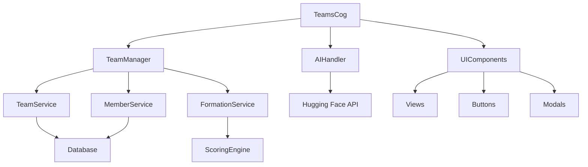

# Teams Cog Overview

## Cog Architecture and Lifecycle

The Teams Cog represents the core functionality of the Discord Team Management Bot, implementing a modular architecture that separates concerns across multiple specialized components.

### Cog Structure
```
cogs/teams/
├── cog.py              # Main cog class and command definitions
├── permissions.py      # Role-based access control
├── panel_management.py # UI panel state management
├── event_listeners.py  # Discord event handling
├── profile_parsing.py  # AI profile extraction
├── models/
│   └── team.py        # Team data models and validation
├── services/
│   ├── team_manager.py       # Orchestration layer
│   ├── team_service.py       # Core team CRUD operations
│   ├── team_member_service.py # Member management
│   ├── marathon_service.py     # Marathon management
│   ├── team_formation_service.py  # Team formation management
│   ├── team_validation.py     # Team validation operations
│   ├── ai_handler.py         # AI integration
│   ├── scoring_engine.py     # Compatibility algorithms
│   ├── category_matcher.py     # Compatibility algorithms Based on Category
│   └── base_domain_keywords.py     # Disctionary Used For Category Matching
├── ui/
│   ├── views.py       # Discord UI view components
│   ├── buttons.py     # Interactive button handlers
│   └── modals.py      # Form input modals
└── utils/
    ├── team_utils.py     # Team utility functions
    └── timezone_utils.py # Timezone handling
```

## Command Registration and Routing

### Slash Command Architecture
```python
# Bot/cogs/teams/cog.py - Command registration pattern
class TeamsCog(commands.Cog):
    def __init__(self, bot):
        self.bot = bot
        self.db = bot.db
        self.config = TeamConfig()
        self.team_manager = TeamManager(self.db)
        self.ai_handler = AIHandler()
        self.marathon_service = MarathonService(self)
        self.permission_manager = PermissionManager()
        self.panel_manager = PanelManager(self)
        self.event_listeners = EventListeners(self)
        self.profile_parser = ProfileParser(self)
```

### Command Routing System
The cog provides Moderator-only commands:

1. **Information Commands**
   - `/marathon_status` - Show the current marathon state (active/Inactive) and provides management options.
   - `/panel` - Creates The Main team management panel.
   - `/sync` - Manually synchronizes the database with Discord.

2. **Team Management Commands**
   - `/create_team` - Creates a new team.
   - `/add_members` - Add members to an existing team.
   - `/manual_save` - Manually saves profile data for an unassigned member.

### Permission Decorator System
```python
# Bot/cogs/teams/permissions.py - Access control
def moderator_required(func):
    """
    Decorator to ensure the user has moderator privileges.
    It finds the central PermissionManager instance from the bot's TeamsCog.
    """
    @wraps(func)
    async def wrapper(*args, **kwargs):
        interaction: Interaction = None
        for arg in args:
            if isinstance(arg, Interaction):
                interaction = arg
                break
        if not interaction:
            interaction = kwargs.get("interaction")
        if not interaction:
            logger.error("Decorator 'moderator_required' could not find an Interaction object.")
            return
        teams_cog = interaction.client.get_cog('TeamsCog')
        if not teams_cog or not hasattr(teams_cog, 'permission_manager'):
            logger.error("Permission manager not found in TeamsCog. Ensure the cog is loaded.")
            return await interaction.response.send_message("❌ Permission system error.", ephemeral=True)
        if not teams_cog.permission_manager.is_moderator(interaction.user):
            return await interaction.response.send_message("❌ You need moderator privileges.", ephemeral=True)
        return await func(*args, **kwargs)
    return wrapper
```

## Event Handling Mechanisms

### Discord Event Integration
```python
# Bot/cogs/teams/event_listeners.py - Event handling
class EventListeners:
    """Handles all event listeners for the bot."""
    def __init__(self, cog):
        self.cog = cog
        self.bot = cog.bot
        self.db = cog.db
        self.config = cog.config
        self.profile_parser = ProfileParser(cog)

    async def on_ready(self):
        """Initializes the cog and restores persistent views."""
        # Refresh panel on startup to ensure views are active
        panel_data = await self.db.get_team_panel(guild.id)
        if panel_data:
            self.bot.add_view(MainPanelView(self.cog), message_id=panel_data["message_id"])

    async def on_raw_reaction_add(self, payload: discord.RawReactionActionEvent):
        """Handles profile parsing via reaction."""
        if payload.channel_id != self.config.communication_channel_id or str(payload.emoji) != REACTION_EMOJI:
            return
        ...
        await self.profile_parser.handle_profile_parsing(message)
```

### Event Processing Pipeline
1. **Message Events**: Profile extraction and team interaction
2. **Member Events**: Join/leave handling and cleanup
3. **Reaction Events**: For profile parsing
4. **Interaction Events**: Button/modal callback routing

## State Management Within the Cog

### Service Layer Architecture
```python
# Bot/cogs/teams/services/team_manager.py - State orchestration
class TeamManager:
    def __init__(self, db):
        self.db = db
        self.team_service = TeamService(db)
        self.member_service = TeamMemberService(db)
        self.formation_service = TeamFormationService(db)
        self.scoring_engine = TeamScoringEngine()
        self.validator = TeamValidator()
```

### State Persistence Strategy
The cog maintains state across multiple layers:

1. **Database State**: Persistent team and member data
2. **UI State**: Active panels and interactive components
3. **Session State**: Temporary interaction data
4. **Cache State**: Frequently accessed data optimization

### UI State Management
```python
# Bot/cogs/teams/panel_management.py - Panel state
class PanelManager:
    def __init__(self, cog):
        self.cog = cog
        self.active_panels = {}  # Track active UI panels

    async def refresh_team_panel(self, guild_id: int, interaction: Interaction = None):
        """Refreshes the team panel message after performing a full data sync."""
        ...
        await self.cog.sync_database_with_discord(guild)
        embed = await self.build_teams_embed(guild_id)
        ...
```

## Integration with Other System Components

### Database Integration Pattern
```python
# Service layer database integration
class TeamService:
    def __init__(self, db):
        self.db = db

    async def create_team(self, guild: discord.Guild, team_number: int, channel_name: str, member_mentions: str) -> Team:
        """Create team with validation and error handling."""
        # Validation
        self.validator.validate_team_number(team_number)

        # Database operation
        members = await self.member_service.create_member_objects(guild, valid_ids, not is_marathon)
        team = Team(guild_id=guild.id, team_role=team_role, channel_name=formatted_channel, members=members, _team_number=team_number)
        await self.db.insert_team(vars(team))

        # Success handling
        logger.info(f"Created team '{team_role}' with {len(members)} members.")
        return team
```

### AI Service Integration
```python
# Bot/cogs/teams/services/ai_handler.py - AI integration
class AIHandler:
    async def extract_profile_data(self, text: str) -> Dict:
        """Extract structured profile data using AI."""
        try:
            loop = asyncio.get_event_loop()
            completion = await loop.run_in_executor(
                None,
                lambda: self.client.chat_completion(
                    messages=[{"role": "user", "content": prompt}],
                    model=self.model_name,
                    temperature=0.2,
                    max_tokens=512
                )
            )
            raw_response = completion.choices[0].message.content.strip()
            return self._parse_ai_response(raw_response)
        except Exception as e:
            logger.error(f"An unexpected error occurred during profile extraction: {e}")
            raise AIExtractionError(f"Profile extraction failed: {str(e)}") from e
```

### Cross-Service Communication


### Error Propagation and Handling
```python
# Centralized error handling in cog
async def handle_interaction_error(self, interaction: discord.Interaction, error: Exception):
    """Unified error handling for all interactions."""
    if isinstance(error, TeamNotFoundError):
        await interaction.followup.send("❌ Team not found.", ephemeral=True)
    elif isinstance(error, InvalidTeamError):
        await interaction.followup.send(f"❌ Invalid team data: {error}", ephemeral=True)
    else:
        logger.exception(f"Unexpected error in {interaction.command}: {error}")
        await interaction.followup.send("❌ An unexpected error occurred.", ephemeral=True)
```

### Component Lifecycle Management
1. **Initialization**: Service dependencies injected during cog setup
2. **Runtime**: Stateless service operations with database persistence
3. **Cleanup**: Graceful shutdown handling for active UI components
4. **Recovery**: Automatic restoration of persistent UI elements on restart

### Inter-Cog Communication
The Teams Cog is designed to be self-contained but extensible:
- **Event Broadcasting**: Publishes team events for other cogs to consume
- **API Interface**: Exposes team data through well-defined methods
- **Hook System**: Allows other cogs to register team lifecycle callbacks
