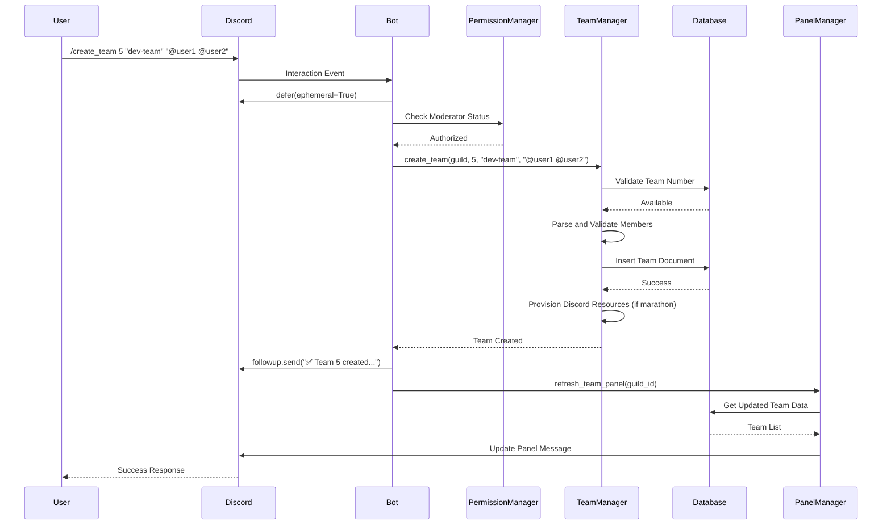

# Slash Commands Workflow

## Overview

The Discord team management bot implements a comprehensive slash command system built on Discord's application command framework. The `TeamsCog` class serves as the central command handler, orchestrating complex team management operations through a modular architecture that emphasizes validation, permission management, and robust error handling.

## Command Registration and Architecture

### Bot Integration and Cog Structure

```python
class TeamsCog(commands.Cog):
    """Main cog for all team management functionality."""

    def __init__(self, bot: commands.Bot):
        self.bot = bot
        self.db = bot.db
        self.config = TeamConfig()
        self.team_manager = TeamManager(self.db)
        self.ai_handler = AIHandler()
        self.marathon_service = MarathonService(self)

        # Component managers for specialized functionality
        self.permission_manager = PermissionManager()
        self.panel_manager = PanelManager(self)
        self.event_listeners = EventListeners(self)
        self.profile_parser = ProfileParser(self)

        # Add persistent view for interactive UI
        bot.add_view(MainPanelView(self))
```

The cog architecture provides:
- **Dependency Injection**: Database and service dependencies injected at initialization
- **Component Isolation**: Specialized managers handle distinct functionality domains
- **Persistent Views**: UI components survive bot restarts
- **Centralized Configuration**: Single source of truth for team management settings

### Global Command Synchronization

Commands are automatically synchronized with Discord's API during bot startup:

```python
# Bot/main.py - Command synchronization
@bot.event
async def on_ready():
    synced_global = await bot.tree.sync()
    logger.info(f"Synced {len(synced_global)} global commands")
```

**Benefits**:
- **Global Availability**: Commands work across all servers
- **Automatic Discovery**: Discord clients show available commands with descriptions
- **Type Safety**: Parameter validation handled at Discord API level
- **Rich Interactions**: Support for complex parameter types and descriptions

## Permission System and Authorization

### Role-Based Access Control

The bot implements a sophisticated permission system through the `PermissionManager` and custom decorators:

```python
from .permissions import PermissionManager, moderator_required

@moderator_required
async def create_team(self, interaction: Interaction, team_number: int, channel_name: str, members: str):
    """Only users with moderator roles can create teams."""
```

#### Permission Hierarchy
1. **Administrator**: Discord server administrators (highest priority)
2. **Moderator Roles**: Configurable roles defined in `MODERATOR_ROLES`
3. **Team Leaders**: Can manage their own teams
4. **Regular Members**: Can view team information

#### Permission Decorator Implementation
```python
def moderator_required(func):
    """Decorator enforcing moderator permissions on slash commands."""
    @wraps(func)
    async def wrapper(self, interaction: discord.Interaction, *args, **kwargs):
        if not await self.permission_manager.is_moderator(interaction.user, interaction.guild):
            await interaction.response.send_message(
                "❌ You don't have permission to use this command.",
                ephemeral=True
            )
            return
        return await func(self, interaction, *args, **kwargs)
    return wrapper
```

## Core Slash Commands Implementation

### 1. `/panel` - Team Management Panel Creation

**Purpose**: Creates or refreshes the main interactive team management panel.

```python
@app_commands.command(name="panel", description="Creates the main team management panel.")
@moderator_required
async def create_panel(self, interaction: discord.Interaction):
    """Create or refresh the team management panel."""
    await interaction.response.defer(ephemeral=True)

    # Check for existing panel to prevent duplicates
    existing = await self.db.get_team_panel(interaction.guild_id)
    if existing:
        try:
            channel = self.bot.get_channel(existing["channel_id"])
            await channel.fetch_message(existing["message_id"])
            await interaction.followup.send(
                "ℹ️ Team panel already exists in this server.",
                ephemeral=True
            )
            return
        except (discord.NotFound, discord.Forbidden):
            # Clean up stale panel reference
            await self.db.delete_team_panel(interaction.guild_id)

    # Create new panel with embedded team information
    embed = await self.panel_manager.build_teams_embed(interaction.guild_id)
    view = MainPanelView(self)
    msg = await interaction.channel.send(embed=embed, view=view)

    # Store panel reference for future updates
    await self.db.save_team_panel(interaction.guild_id, interaction.channel_id, msg.id)
    await interaction.followup.send("✅ Team management panel created!", ephemeral=True)
```

**Workflow**:
1. **Permission Check**: Verify moderator status
2. **Duplicate Prevention**: Check for existing panels
3. **Cleanup**: Remove stale panel references
4. **Panel Creation**: Generate embed with current team data
5. **Persistence**: Store panel reference for future updates

**Error Handling**:
- Stale panel cleanup when Discord messages are deleted
- Permission denied responses for unauthorized users
- Database operation failure recovery

### 2. `/create_team` - New Team Creation

**Purpose**: Creates a new team with specified parameters, validates inputs, and provisions resources.

```python
@app_commands.command(name="create_team", description="Creates a new team.")
@app_commands.describe(
    team_number="Unique number for the team.",
    channel_name="Name for the private channel.",
    members="Mention all team members."
)
@moderator_required
async def create_team(self, interaction: Interaction, team_number: int, channel_name: str, members: str):
    await interaction.response.defer(ephemeral=True)

    try:
        # Delegate to team manager for business logic
        team = await self.team_manager.create_team(
            interaction.guild, team_number, channel_name, members
        )

        response_parts = [f"✅ `{team.team_role}` created with {len(team.members)} members."]
        await interaction.followup.send(" ".join(response_parts), ephemeral=True)

        # Update panel to reflect new team
        await self.panel_manager.refresh_team_panel(interaction.guild_id)

    except (InvalidTeamError, TeamError) as e:
        # Provide contextual error messages based on marathon state
        error_msg = str(e)
        if "don't have 'Team Leader' or 'Team Member' roles" in error_msg:
            is_marathon_active = await self.team_manager.is_marathon_active(interaction.guild_id)
            if is_marathon_active:
                error_msg += " Note: During marathon, only registered members with team roles can be added."
        await interaction.followup.send(f"❌ {error_msg}", ephemeral=True)
```

**Validation Pipeline** (handled by `TeamManager.create_team`):
1. **Team Number Validation**: Ensures unique, within valid range
2. **Channel Name Formatting**: Sanitizes and validates Discord channel naming rules
3. **Member Parsing**: Extracts user IDs from Discord mentions
4. **Marathon State Check**: Determines registration requirements
5. **Member Validation**: Verifies users exist, aren't bots, have required roles
6. **Team Size Limits**: Enforces maximum team size constraints

**Resource Provisioning**:
- **Database Entry**: Creates team document with member data
- **Discord Resources**: During marathon mode, creates Discord role and private channel
- **Panel Updates**: Refreshes team management panel to show new team

### 3. `/add_members` - Team Member Addition

**Purpose**: Adds new members to existing teams with comprehensive validation and conflict resolution.

```python
@app_commands.command(name="add_members", description="Adds members to an existing team.")
@app_commands.describe(
    team_number="The number of the team (e.g., 1 for Team 1).",
    members="Mention one or more members to add."
)
@moderator_required
async def add_members(self, interaction: Interaction, team_number: int, members: str):
    await interaction.response.defer(ephemeral=True)

    try:
        team_name = f"Team {team_number}"
        is_marathon_active = await self.team_manager.is_marathon_active(interaction.guild_id)

        # Delegate to team manager with detailed conflict reporting
        added_members, existing_members, invalid_members, in_other_teams = await self.team_manager.add_members_to_team(
            interaction.guild, team_name, members
        )

        # Build comprehensive response with categorized results
        response_parts = []

        if added_members:
            response_parts.append(f"✅ Successfully added {len(added_members)} members to `{team_name}`.")

        # Context-aware warning messages
        warnings = []
        if existing_members:
            warnings.append(f"{len(existing_members)} already in this team")
        if in_other_teams:
            warnings.append(f"{len(in_other_teams)} already in other teams")
        if invalid_members:
            if is_marathon_active:
                warnings.append(f"{len(invalid_members)} invalid/unregistered")
            else:
                warnings.append(f"{len(invalid_members)} invalid (bots or non-existent users)")

        if warnings:
            response_parts.append(f"⚠️ Skipped members: {', '.join(warnings)}.")

        if not added_members and not warnings:
            response_parts.append("ℹ️ No members were added.")

        await interaction.followup.send(" ".join(response_parts), ephemeral=True)
        await self.panel_manager.refresh_team_panel(interaction.guild_id)

    except TeamError as e:
        # Marathon-context error messaging
        error_msg = str(e)
        if "don't have 'Team Leader' or 'Team Member' roles" in error_msg:
            is_marathon_active = await self.team_manager.is_marathon_active(interaction.guild_id)
            if is_marathon_active:
                error_msg += " Note: During marathon, only registered members with team roles can be added."
        await interaction.followup.send(f"❌ {error_msg}", ephemeral=True)
```

**Member Addition Pipeline**:
1. **Team Lookup**: Verify team exists using standardized naming
2. **Marathon State**: Determine member validation requirements
3. **Member Parsing**: Extract user IDs from Discord mentions
4. **Conflict Detection**: Check for existing team memberships
5. **Validation**: Verify user permissions and registration status
6. **Database Update**: Add valid members to team document
7. **Discord Sync**: Update Discord roles during marathon mode

**Conflict Resolution Categories**:
- **Already in Team**: Users already members of target team
- **In Other Teams**: Users assigned to different teams
- **Invalid Users**: Bots, non-existent users, or unregistered during marathon
- **Permission Issues**: Users lacking required roles

### 4. `/sync` - Database Synchronization

**Purpose**: Manually synchronizes database state with current Discord server state.

```python
@app_commands.command(name="sync", description="Manually synchronizes the database with Discord.")
@moderator_required
async def sync_command(self, interaction: Interaction):
    await interaction.response.defer(thinking=True, ephemeral=True)

    # Delegate to centralized sync method
    report = await self.sync_database_with_discord(interaction.guild)

    await interaction.followup.send(
        "✅ Database synchronization complete." if report else "❌ Sync failed.",
        ephemeral=True
    )
```

**Synchronization Process** (via `sync_database_with_discord`):
```python
async def sync_database_with_discord(self, guild: discord.Guild) -> Dict:
    """Centralized method to synchronize database with Discord state."""
    try:
        report = await self.team_manager.reflect_teams(guild)
        return report
    except Exception as e:
        logger.error(f"Error during data sync for guild {guild.id}: {e}", exc_info=True)
        return {}
```

**Reflection Process** (via `TeamManager.reflect_teams`):
1. **Team Analysis**: Identify empty teams and teams without leaders
2. **Member Validation**: Update member data from current Discord state
3. **Unassigned Member Sync**: Reconcile registered but unassigned members
4. **Conflict Detection**: Report inconsistencies between database and Discord

### 5. `/manual_save` - Profile Data Management

**Purpose**: Manually saves profile data for unassigned members with team roles.

```python
@app_commands.command(name="manual_save", description="Manually saves profile data for an unassigned member.")
@app_commands.describe(
    user="The member to save data for.",
    timezone="e.g., EST, PST, GMT",
    goals="Comma-separated list.",
    habits="Comma-separated list."
)
@moderator_required
async def manual_save(self, interaction: Interaction, user: Member, timezone: str = None, goals: str = None, habits: str = None):
    await interaction.response.defer(ephemeral=True)

    # Build profile data from optional parameters
    profile_data = {}
    if timezone: profile_data["timezone"] = timezone.strip()
    if goals: profile_data["goals"] = [g.strip() for g in goals.split(',')]
    if habits: profile_data["habits"] = [h.strip() for h in habits.split(',')]

    if not profile_data:
        return await interaction.followup.send("❌ No data provided to save.", ephemeral=True)

    # Validate user has required role
    role_title = get_member_role_title(user)
    if role_title == "Unregistered":
        return await interaction.followup.send(
            f"❌ {user.mention} needs a 'Team Leader' or 'Team Member' role.",
            ephemeral=True
        )

    # Determine storage category and save
    role_type = "leaders" if role_title == "Team Leader" else "members"
    member_data = {
        "username": user.name,
        "display_name": user.display_name,
        "role_title": role_title,
        "profile_data": profile_data
    }

    await self.db.save_unregistered_member(interaction.guild.id, str(user.id), member_data, role_type)
    await interaction.followup.send(f"✅ Profile data saved for unassigned member {user.mention}.", ephemeral=True)
```

**Profile Data Structure**:
- **Timezone**: User's preferred timezone (string)
- **Goals**: List of user objectives
- **Habits**: List of user behaviors/preferences
- **Role Segregation**: Leaders and members stored separately for team formation algorithms

### 6. `/marathon_status` - Marathon State Management

**Purpose**: Displays current marathon state and provides state management capabilities.

```python
@app_commands.command(name="marathon_status", description="Shows the current marathon state and provides management options.")
@app_commands.describe(
    set_active="Optional: Set marathon state to active (True) or inactive (False)"
)
@moderator_required
async def marathon_status(self, interaction: Interaction, set_active: Optional[bool] = None):
    await interaction.response.defer(ephemeral=True)

    try:
        if set_active is not None:
            # Update marathon state
            success = await self.team_manager.db.set_marathon_state(interaction.guild_id, set_active)

            if not success:
                await interaction.followup.send("❌ Failed to update marathon state.", ephemeral=True)
                return

            # Generate detailed confirmation embed
            state_text = "**ACTIVE**" if set_active else "**INACTIVE**"
            action_text = "activated" if set_active else "deactivated"

            embed = discord.Embed(
                title="Marathon State Updated",
                description=f"Marathon has been **{action_text}**",
                color=discord.Color.green() if set_active else discord.Color.orange()
            )

            embed.add_field(name="New State", value=state_text, inline=True)
            embed.add_field(name="Changed By", value=interaction.user.mention, inline=True)
            embed.add_field(
                name="Timestamp",
                value=f"<t:{int(discord.utils.utcnow().timestamp())}:F>",
                inline=True
            )

            # Context-specific effects explanation
            if set_active:
                embed.add_field(
                    name="Effects",
                    value="• Teams now have Discord roles and channels\n• Only registered members can join teams\n• Team resources are provisioned automatically",
                    inline=False
                )
            else:
                embed.add_field(
                    name="Effects",
                    value="• Teams exist in database only\n• Unregistered members can join teams\n• No Discord resources are provisioned",
                    inline=False
                )

            await interaction.followup.send(embed=embed, ephemeral=True)
            await self.panel_manager.refresh_team_panel(interaction.guild_id)

        else:
            # Display current state information
            state_info = await self.team_manager.get_marathon_state_info(interaction.guild_id)
            is_active = state_info["is_active"]

            embed = discord.Embed(
                title="Marathon Status",
                color=discord.Color.green() if is_active else discord.Color.orange()
            )

            if is_active:
                embed.add_field(
                    name="Current State",
                    value="**ACTIVE**\n• Teams have Discord roles and channels\n• Only registered members can join teams\n• Team resources are provisioned automatically",
                    inline=False
                )
            else:
                embed.add_field(
                    name="Current State",
                    value="**INACTIVE**\n• Teams exist in database only\n• Unregistered members can join teams\n• No Discord resources are provisioned",
                    inline=False
                )

            if state_info.get("last_changed"):
                embed.add_field(
                    name="Last Changed",
                    value=f"<t:{int(state_info['last_changed'].timestamp())}:R>",
                    inline=True
                )

            embed.add_field(
                name="Usage",
                value="Use `/marathon_status set_active:True` to activate\nUse `/marathon_status set_active:False` to deactivate",
                inline=False
            )

            await interaction.followup.send(embed=embed, ephemeral=True)

    except Exception as e:
        logger.error(f"Error in marathon_status command: {e}")
        await interaction.followup.send("❌ Failed to process marathon status command.", ephemeral=True)
```

**Marathon State Effects**:

**Active State**:
- Teams receive Discord roles and private channels
- Only users with "Team Leader" or "Team Member" roles can join teams
- Automatic resource provisioning during team creation
- Enhanced validation requirements

**Inactive State**:
- Teams exist only in database
- Unregistered users can join teams
- No Discord resource creation
- Relaxed validation for rapid team formation

## Interaction Response Patterns

### Standard Response Flow

All slash commands follow a consistent interaction pattern:

```python
async def command_template(self, interaction: Interaction, parameter: str):
    # 1. Initial response (required within 3 seconds)
    await interaction.response.defer(ephemeral=True)

    try:
        # 2. Business logic processing
        result = await self.process_command_logic(parameter)

        # 3. Success response
        await interaction.followup.send("✅ Operation successful", ephemeral=True)

        # 4. UI updates (if applicable)
        await self.panel_manager.refresh_team_panel(interaction.guild_id)

    except SpecificError as e:
        # 5. Contextual error handling
        await interaction.followup.send(f"❌ {e}", ephemeral=True)
```

### Response Categories and Patterns

#### Success Responses
```python
# Clear success indication with relevant metrics
response_parts = [f"✅ `{team.team_role}` created with {len(team.members)} members."]
await interaction.followup.send(" ".join(response_parts), ephemeral=True)
```

#### Warning Responses
```python
# Detailed breakdown of issues with categorization
warnings = []
if existing_members:
    warnings.append(f"{len(existing_members)} already in this team")
if in_other_teams:
    warnings.append(f"{len(in_other_teams)} already in other teams")

if warnings:
    response_parts.append(f"⚠️ Skipped members: {', '.join(warnings)}.")
```

#### Error Responses
```python
# Context-aware error messages with actionable guidance
error_msg = str(e)
if "don't have 'Team Leader' or 'Team Member' roles" in error_msg:
    is_marathon_active = await self.team_manager.is_marathon_active(interaction.guild_id)
    if is_marathon_active:
        error_msg += " Note: During marathon, only registered members with team roles can be added."
await interaction.followup.send(f"❌ {error_msg}", ephemeral=True)
```

### Rich Embed Responses

For complex information display, commands utilize Discord embeds:

```python
embed = discord.Embed(
    title="Marathon State Updated",
    description=f"Marathon has been **{action_text}**",
    color=discord.Color.green() if set_active else discord.Color.orange()
)

embed.add_field(name="New State", value=state_text, inline=True)
embed.add_field(name="Changed By", value=interaction.user.mention, inline=True)
embed.add_field(
    name="Timestamp",
    value=f"<t:{int(discord.utils.utcnow().timestamp())}:F>",
    inline=True
)
```

## Error Handling and Recovery

### Global Error Handler

```python
async def cog_app_command_error(self, interaction: Interaction, error: app_commands.AppCommandError):
    """Global error handler for slash commands in this cog."""
    if isinstance(error, app_commands.MissingPermissions):
        await interaction.response.send_message(
            "❌ You don't have permission to use this command.",
            ephemeral=True
        )
    elif isinstance(error, TeamError):
        await interaction.response.send_message(f"❌ {error}", ephemeral=True)
    else:
        logger.error(f"An unhandled command error occurred in TeamsCog: {error}", exc_info=True)
        response_method = interaction.followup.send if interaction.response.is_done() else interaction.response.send_message
        await response_method(
            "❌ A critical error occurred. The incident has been logged.",
            ephemeral=True
        )
```

### Error Categories

1. **Permission Errors**: Access denied responses
2. **Validation Errors**: Input validation failures
3. **Business Logic Errors**: Domain-specific constraint violations
4. **System Errors**: Database or Discord API failures

### Recovery Mechanisms

- **Graceful Degradation**: Partial success reporting
- **State Consistency**: Rollback on critical failures
- **User Guidance**: Clear next steps and troubleshooting
- **Logging**: Comprehensive error tracking for debugging

## Command Interaction Flow



This comprehensive workflow documentation provides detailed insight into how each slash command operates, their specific purposes, validation mechanisms, and integration with the broader team management system. The modular architecture ensures maintainability while providing robust functionality for Discord server team management.
