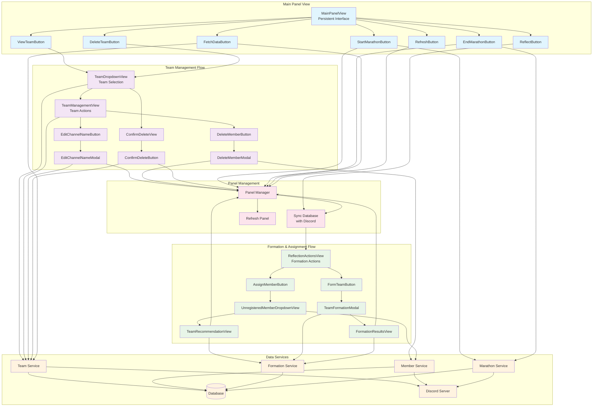

# UI Components Workflow

## Discord UI Component Architecture

The bot's UI system is built around Discord's interaction components, implementing a modular architecture with three core files: `buttons.py`, `modals.py`, and `views.py`. The system uses the `@moderator_required` decorator for permissions and centralized error handling through the base `TeamButton` class.

### Component File Structure
```
UI Components
├── buttons.py (Action triggers and base classes)
│   ├── TeamButton (Base class with error handling)
│   ├── Main Panel Buttons (ViewTeamButton, DeleteTeamButton, etc.)
│   ├── Team Management Buttons (DeleteMemberButton, EditChannelNameButton)
│   └── Formation Action Buttons (AssignMemberButton, FormTeamButton)
├── modals.py (Form input dialogs)
│   ├── EditChannelNameModal
│   ├── DeleteMemberModal
│   └── TeamFormationModal
└── views.py (UI containers and dropdowns)
    ├── MainPanelView (Primary persistent interface)
    ├── Team Selection Views (TeamDropdownView, TeamManagementView)
    └── Formation Views (ReflectionActionsView, FormationResultsView)
```

## Core Component Architecture

### Base Button Class and Error Handling

The `TeamButton` base class provides centralized error handling and a consistent structure:

```python
class TeamButton(Button):
    def __init__(self, cog, **kwargs):
        super().__init__(**kwargs)
        self.cog = cog

    async def handle_error(self, interaction: discord.Interaction, error: Exception):
        """Standardized error handling for all button interactions."""
        logger.error(f"Error in '{self.label}' button: {error}", exc_info=True)
        # Smart response handling - use followup if initial response was sent
        responder = interaction.followup.send if interaction.response.is_done() else interaction.response.send_message
        await responder("❌ An error occurred. The incident has been logged.", ephemeral=True)
```

All buttons inherit from this base class and use the `@moderator_required` decorator for permission control.

### Main Panel View - The Control Center

The `MainPanelView` serves as the persistent control interface with organized button rows:

```python
class MainPanelView(View):
    def __init__(self, cog, timeout: Optional[float] = None):
        super().__init__(timeout=timeout)
        # Row 0: Core Team & Reflection Actions
        self.add_item(ViewTeamButton(cog))
        self.add_item(DeleteTeamButton(cog))
        self.add_item(ReflectButton(cog))

        # Row 1: Marathon Lifecycle & Syncing
        self.add_item(StartMarathonButton(cog))
        self.add_item(EndMarathonButton(cog))
        self.add_item(FetchDataButton(cog))
        self.add_item(RefreshButton(cog))
```

## Button Component Patterns

### Primary Action Buttons

**ViewTeamButton**: Initiates team selection for viewing
- Creates `TeamDropdownView` with action="view"
- Handles empty team list gracefully
- Uses circular import avoidance pattern

**DeleteTeamButton**: Initiates team deletion workflow
- Creates `TeamDropdownView` with action="delete"
- Leads to confirmation flow via `ConfirmDeleteView`

**ReflectButton**: Combined reflection and formation entry point
- Runs database synchronization via `sync_database_with_discord`
- Builds reflection embed showing team health
- Conditionally shows `ReflectionActionsView` if unassigned members exist

### Marathon Management Buttons

**StartMarathonButton** and **EndMarathonButton**:
- Use `defer(thinking=True, ephemeral=True)` for long operations
- Create detailed result embeds showing created/removed resources
- Refresh the team panel after completion
- Include comprehensive error handling for Discord permission issues

### Data Management Buttons

**RefreshButton**: Single-call panel refresh
```python
async def callback(self, interaction: discord.Interaction):
    await interaction.response.defer(thinking=True, ephemeral=True)
    # Single method handles both DB sync and panel refresh
    await self.cog.panel_manager.refresh_team_panel(interaction.guild_id, interaction)
```

**FetchDataButton**: Server data synchronization
- Fetches teams from Discord server state
- Provides detailed statistics (registered, skipped counts)
- Auto-refreshes panel if new teams are registered

## Modal Component Workflows

### EditChannelNameModal - Channel Name Management

Implements comprehensive channel renaming with validation:

```python
class EditChannelNameModal(Modal, title="Edit Team Channel Name"):
    def __init__(self, cog, team_data: Dict):
        super().__init__(timeout=300)
        self.cog = cog
        self.team_data = team_data
        # Pre-populate with current channel name
        self.new_name.default = team_data.get("channel_name", "")

    async def on_submit(self, interaction: discord.Interaction):
        # 1. Format and validate the name
        formatted_name = self._format_channel_name(self.new_name.value)

        # 2. Update database first
        await self.cog.team_manager.team_service.update_team_channel_name(...)

        # 3. Update Discord channel if it exists
        await self._update_discord_channel(interaction.guild, formatted_name)

        # 4. Refresh panel to show changes
        await self.cog.panel_manager.refresh_team_panel(interaction.guild.id)
```

### DeleteMemberModal - Multi-Member Removal

Supports comma-separated member number input:

```python
async def on_submit(self, interaction: discord.Interaction):
    # Parse comma-separated numbers
    input_numbers_str = [n.strip() for n in self.member_numbers.value.split(',')]

    # Get current team member list for index validation
    team = await self.cog.team_manager.team_service.get_team(interaction.guild.id, self.team_role)
    members_list = list(team.members.items())

    # Convert numbers to user IDs with validation
    member_ids_to_remove = set()
    invalid_numbers = []

    for num_str in input_numbers_str:
        member_index = int(num_str) - 1
        if 0 <= member_index < len(members_list):
            user_id, _ = members_list[member_index]
            member_ids_to_remove.add(user_id)
        else:
            invalid_numbers.append(num_str)
```

### TeamFormationModal - Confirmation Gateway

Acts as a safety gate for team formation:

```python
async def on_submit(self, interaction: discord.Interaction):
    # Require exact confirmation text
    if self.confirmation.value.upper() != 'FORM':
        return await interaction.response.send_message("❌ Confirmation text did not match...")

    # Process unassigned members, adding user_id to profiles
    for user_id, profile_data in unassigned_doc.get("leaders", {}).items():
        leader_profile = dict(profile_data)
        leader_profile['user_id'] = user_id  # Critical for formation algorithm
        leaders.append(leader_profile)

    # Run formation algorithm
    proposed_teams = await self.cog.team_manager.formation_service.form_teams_hierarchical(leaders, members)

    # Show results in FormationResultsView for final confirmation
    view = FormationResultsView(self.cog, proposed_teams)
    await interaction.followup.send(embed=embed, view=view, ephemeral=True)
```

## View Component Architecture

### Team Selection and Management Flow

**TeamDropdown**: Core selection component
```python
class TeamDropdown(Select):
    async def callback(self, interaction: discord.Interaction):
        selected_team_name = self.values[0]
        team = await self.cog.team_manager.team_service.get_team(interaction.guild_id, selected_team_name)

        if self.action == "view":
            embed = await self._build_team_embed(interaction.guild, team)
            view = TeamManagementView(self.cog, team)  # Next step in workflow
            await interaction.followup.send(embed=embed, view=view, ephemeral=True)

        elif self.action == "delete":
            view = ConfirmDeleteView(self.cog, team.team_role)  # Confirmation step
            await interaction.followup.send(f"**Are you sure...**", view=view, ephemeral=True)
```

**Team Embed Building**: Real-time member status
```python
async def _build_team_embed(self, guild: discord.Guild, team: Team) -> discord.Embed:
    members_info = []
    for i, (user_id, db_member) in enumerate(team.members.items(), 1):
        discord_member = await fetch_member_safely(guild, user_id)
        if discord_member:
            # Use live Discord data for current status
            current_role = get_member_role_title(discord_member)
            line = f"`{i: >2} • {discord_member.display_name} • {current_role}`"
        else:
            # Handle members who left the server
            line = f"`{i: >2} • {db_member.display_name} • (Deactivated)`"
        members_info.append(line)
```

### Formation and Assignment Workflows

**UnregisteredMemberDropdown**: Member selection for assignment
```python
async def callback(self, interaction: discord.Interaction):
    selected_user_id = self.values[0]

    # Get member profile
    member_profile = await self.cog.team_manager.member_service.get_unassigned_member_profile(...)

    # Find suitable teams using formation algorithm
    all_teams = await self.cog.team_manager.team_service.get_all_teams(interaction.guild_id)
    recommendations = await self.cog.team_manager.formation_service.find_best_teams_for_member(member_profile, all_teams)

    # Show recommendations in next view
    view = TeamRecommendationView(self.cog, selected_user_id, recommendations)
```

**TeamRecommendationDropdown**: Direct assignment action
```python
async def callback(self, interaction: discord.Interaction):
    await interaction.response.defer()  # Immediate acknowledgment
    selected_team_name = self.values[0]

    # Execute assignment
    success, message = await self.cog.team_manager.formation_service.assign_member_to_team(...)

    # Disable view after action (prevents double-clicks)
    for item in self.view.children:
        item.disabled = True

    await interaction.edit_original_response(content=f"{'✅' if success else '❌'} {message}", view=self.view)
```

**FormationResultsView**: Batch team creation confirmation
```python
class FormationResultsView(View):
    def __init__(self, cog, proposed_teams: List[Team], timeout: float = 300):
        super().__init__(timeout=timeout)
        confirm_button = discord.ui.Button(label=f"Create {len(proposed_teams)} New Teams", style=discord.ButtonStyle.success)

        async def confirm_callback(interaction: discord.Interaction):
            results = await self.cog.team_manager.formation_service.batch_create_teams(interaction.guild, self.proposed_teams)
            await interaction.followup.send(f"✅ Formation complete! Created: {results['created']}, Failed: {len(results['failed'])}.")
            await self.cog.panel_manager.refresh_team_panel(interaction.guild_id)
```

## Component Interaction Patterns

### Circular Import Avoidance

The codebase uses strategic local imports to avoid circular dependencies:

```python
# In buttons.py
async def callback(self, interaction: discord.Interaction):
    try:
        from .views import TeamDropdownView # Avoid circular import
        teams = await self.cog.team_manager.team_service.get_all_teams(interaction.guild_id)
```

### Error Handling Hierarchy

1. **Component Level**: Each button/modal handles specific errors
2. **Base Class Level**: `TeamButton.handle_error()` provides fallback
3. **Service Level**: Business logic errors bubble up with context
4. **Permission Level**: `@moderator_required` decorator handles authorization

### State Management and Persistence

**Panel Refresh Strategy**:
- Single source of truth: `panel_manager.refresh_team_panel()`
- Called after state-changing operations
- Handles both database sync and UI update

**View Lifecycle Management**:
- Persistent views: `MainPanelView` (timeout=None)
- Temporary views: 180-300 second timeouts
- Post-action cleanup: Disable components after single-use actions

## Data Flow Architecture

### Team Management Flow
1. **ViewTeamButton** → **TeamDropdownView** → **TeamManagementView**
2. Team selection creates detailed embed with real-time member status
3. Management view provides context-specific actions (edit channel, remove members)
4. Actions trigger modals or confirmation views
5. Successful operations refresh the main panel

### Formation Flow
1. **ReflectButton** → Sync database → Build reflection report
2. If unassigned members exist → **ReflectionActionsView**
3. **AssignMemberButton** → **UnregisteredMemberDropdownView** → **TeamRecommendationView**
4. **FormTeamButton** → **TeamFormationModal** → **FormationResultsView**
5. Final confirmation creates teams and refreshes panel

### Marathon Management Flow
1. **StartMarathonButton** → Check marathon state → Create roles/channels
2. Build comprehensive results embed with created resources
3. **EndMarathonButton** → Cleanup resources → Show removal summary
4. Both operations update marathon state and refresh panel

## Comprehensive Workflow Diagram



This workflow diagram illustrates the complete interaction flow between all UI components, showing how user actions flow through the button/modal/view system, interact with the data services, and trigger panel refreshes to maintain UI consistency.
