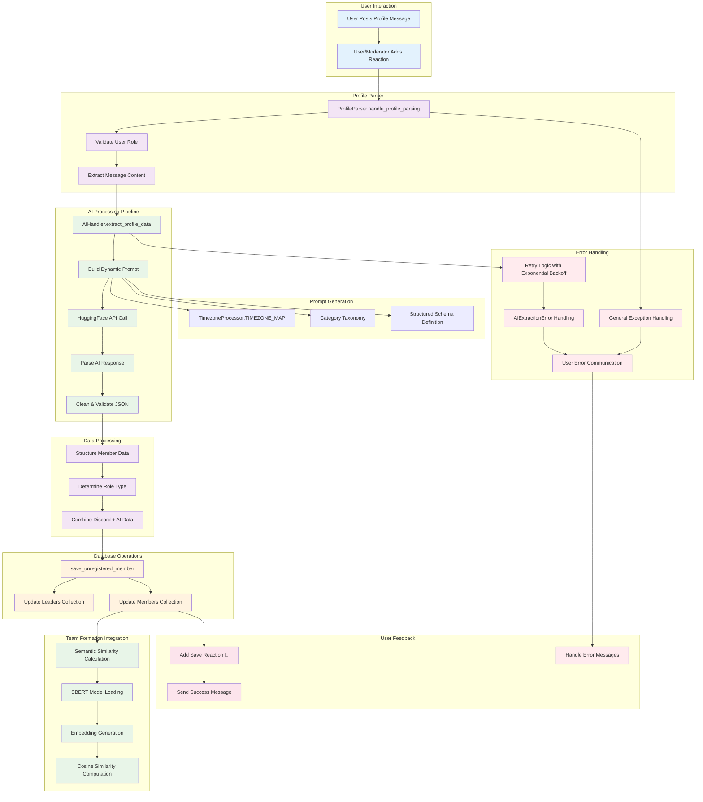

# AI Profile Processing System

## Overview

The AI Profile Processing system is a sophisticated component that extracts structured data from user-written profile texts and enables semantic comparison for team formation. It combines natural language processing with machine learning to transform unstructured user introductions into actionable data for intelligent team matching.

## Core Components

### 1. AIHandler - The AI Orchestrator

The `AIHandler` class serves as the main interface for all AI operations, managing both profile extraction and semantic similarity calculations.

```python
class AIHandler:
    def __init__(self):
        if not HUGGINGFACE_API_TOKEN:
            raise ValueError("HUGGINGFACE_API_TOKEN environment variable not set.")
        self.client = InferenceClient(token=HUGGINGFACE_API_TOKEN)
        self.model_name = HUGGINGFACE_MODEL
        self.similarity_calculator = SimilarityCalculator()
```

**Purpose**: Centralizes AI operations and provides a unified interface for profile processing and semantic comparison.

**Key Responsibilities**:
- Manages HuggingFace API client for large language model interactions
- Coordinates between profile extraction and similarity calculation
- Handles error propagation and retry logic
- Provides semantic comparison capabilities for team matching

### 2. Profile Data Extraction

#### Dynamic Prompt Generation

The system generates sophisticated prompts that guide the AI model to extract structured data:

```python
def _build_profile_prompt(self, profile_text: str) -> str:
    # Dynamically generate the list of timezones from the single source of truth
    valid_timezones = ", ".join(f'"{tz}"' for tz in TimezoneProcessor.TIMEZONE_MAP.keys())

    return f"""
    You are an AI assistant that extracts structured data from user-written profile introductions.
    Return ONLY a valid, compact JSON object with the following fields (omit any missing fields):

    - "timezone": A valid timezone abbreviation from this list ONLY: [{valid_timezones}]
    - "habits": A list of strings describing regular actions or hobbies
    - "goals": A list of strings describing user goals or aspirations
    - "category": A dictionary mapping domains to sub-domains based on user goals and habits
    """
```

**Purpose**: Provides structured guidance to the AI model for consistent data extraction.

**Key Features**:
- **Dynamic Timezone Integration**: Pulls valid timezones from `TimezoneProcessor.TIMEZONE_MAP` for consistency
- **Structured Schema**: Defines exact JSON structure expected from the AI
- **Category Taxonomy**: Provides a comprehensive hierarchy of domains and sub-domains
- **Inference Instructions**: Guides the AI to infer timezones (e.g., "Central European" → "CET")

#### Category Taxonomy System

The system includes a sophisticated categorization framework:

```python
"category": A dictionary mapping a domain to its sub-domains based on the user's goals and habits. Use only sub-domains from this fixed structure:
- "health_and_fitness": ["physical_health", "mental_wellness", "nutrition_and_sleep"]
- "technology_and_computing": ["software_and_web_dev", "emerging_tech_and_ai", "infrastructure_and_security"]
- "business_and_finance": ["business_strategy", "personal_finance_and_investing", "career_and_economics"]
- "education_and_learning": ["academic_and_exam_prep", "language_and_communication", "personal_growth"]
- "creative_arts_and_hobbies": ["arts_and_creation", "performance_and_play", "collection_and_curation"]
- "lifestyle_community_and_adventure": ["home_and_personal_life", "social_and_community", "travel_and_adventure"]
- "science_and_research": ["scientific_fields", "research_process_and_tools"]
```

**Purpose**: Enables precise categorization of user interests for sophisticated team matching algorithms.

#### Retry Logic and Error Handling

```python
@tenacity.retry(
    stop=tenacity.stop_after_attempt(3),
    wait=tenacity.wait_exponential(multiplier=1, min=4, max=10),
    reraise=True
)
async def extract_profile_data(self, text: str) -> Optional[Dict]:
    if len(text) < 20:
        logger.warning("Profile text too short for meaningful extraction.")
        return None

    prompt = self._build_profile_prompt(text)
    try:
        loop = asyncio.get_event_loop()
        completion = await loop.run_in_executor(
            None,
            lambda: self.client.chat_completion(
                messages=[{"role": "user", "content": prompt}],
                model=self.model_name,
                temperature=0.2,
                max_tokens=512
            )
        )
        raw_response = completion.choices[0].message.content.strip()
        return self._parse_ai_response(raw_response)
    except json.JSONDecodeError as e:
        logger.error(f"Failed to parse AI JSON response: {e}. Raw response: '{raw_response}'")
        raise AIExtractionError("Failed to parse AI response.") from e
```

**Purpose**: Ensures reliable AI interaction with graceful failure handling.

**Key Features**:
- **Exponential Backoff**: Implements intelligent retry strategy for transient failures
- **Input Validation**: Rejects profiles too short for meaningful analysis
- **Async Execution**: Uses thread executor to prevent blocking the event loop
- **Temperature Control**: Sets low temperature (0.2) for consistent, structured outputs
- **Error Chaining**: Preserves original error context while providing user-friendly messages

#### Response Parsing and Cleanup

```python
def _parse_ai_response(self, raw: str) -> Dict:
    """Cleans and parses the JSON response from the AI."""
    # Remove markdown code blocks if present
    cleaned = re.sub(r"```json\n?|```", "", raw).strip()
    data = json.loads(cleaned)
    if not isinstance(data, dict):
        raise json.JSONDecodeError("AI response was not a valid JSON object.", cleaned, 0)
    # Filter out empty values for cleaner data
    return {k: v for k, v in data.items() if v}
```

**Purpose**: Robustly parses AI responses while handling common formatting issues.

**Cleanup Operations**:
- **Markdown Removal**: Strips code block formatting that AI models sometimes add
- **Validation**: Ensures response is a valid dictionary
- **Empty Value Filtering**: Removes fields with empty values for cleaner data storage

### 3. Semantic Similarity System

#### SBERT Model Management

```python
_model_cache: Optional[Any] = None
_model_load_lock = asyncio.Lock()

class SimilarityCalculator:
    def __init__(self, model_name: str = 'all-MiniLM-L6-v2', device: str = 'cpu'):
        self.model_name = model_name
        self.device = device
        self.model = None

    async def _load_model(self):
        global _model_cache
        async with _model_load_lock:
            if _model_cache is None:
                logger.info(f"Loading SentenceTransformer model: {self.model_name}...")
                try:
                    from sentence_transformers import SentenceTransformer
                    _model_cache = SentenceTransformer(self.model_name, device=self.device)
                    _model_cache.eval()
                except Exception as e:
                    logger.error(f"Failed to load SBERT model '{self.model_name}'. Error: {e}", exc_info=True)
                    _model_cache = e
                    raise
```

**Purpose**: Provides efficient, thread-safe management of the sentence transformer model.

**Key Features**:
- **Global Caching**: Single model instance shared across all operations
- **Thread Safety**: Uses asyncio lock to prevent concurrent loading
- **Error State Tracking**: Stores exceptions in cache to prevent repeated load attempts
- **Lazy Loading**: Model only loaded when first needed
- **Memory Efficiency**: Uses lightweight 'all-MiniLM-L6-v2' model optimized for speed

#### Semantic Comparison Engine

```python
def _calculate_similarity(self, list1: List[str], list2: List[str]) -> np.ndarray:
    if not list1 or not list2: return np.array([[]])
    try:
        import torch
        from sentence_transformers import util
        with torch.no_grad():
            embeddings1 = self.model.encode(list1, convert_to_tensor=True, device=self.device)
            embeddings2 = self.model.encode(list2, convert_to_tensor=True, device=self.device)
            cosine_scores = util.cos_sim(embeddings1, embeddings2)
        return cosine_scores.cpu().numpy()
    except Exception as e:
        logger.error(f"Error during similarity calculation: {e}", exc_info=True)
        return np.zeros((len(list1), len(list2)))

async def compare(self, list_a: List[str], list_b: List[str]) -> np.ndarray:
    if self.model is None: await self._load_model()
    loop = asyncio.get_event_loop()
    return await loop.run_in_executor(None, self._calculate_similarity, list_a, list_b)
```

**Purpose**: Computes semantic similarity between text lists using state-of-the-art embedding models.

**Technical Implementation**:
- **No-Grad Context**: Disables gradient computation for inference efficiency
- **Tensor Operations**: Uses GPU-accelerated tensor operations when available
- **Cosine Similarity**: Computes cosine similarity between sentence embeddings
- **Async Execution**: Runs computation in thread executor to maintain responsiveness
- **Error Resilience**: Returns zero matrix on computation failures
- **Memory Management**: Converts results to CPU and numpy for downstream processing

### 4. Profile Parser Integration

#### Message-Based Profile Processing

```python
class ProfileParser:
    def __init__(self, cog):
        self.cog = cog
        self.bot = cog.bot
        self.db = cog.db
        self.team_manager = cog.team_manager
        self.ai_handler = cog.ai_handler

    async def handle_profile_parsing(self, message: Message):
        """Internal logic for parsing profile messages from reactions."""
        try:
            extracted_data = await self.ai_handler.extract_profile_data(message.content)
            if not extracted_data:
                return await message.channel.send("❌ AI failed to extract data.", delete_after=10)

            role_title = self.team_manager._get_member_role_title(message.author)
            if role_title == "Unregistered":
                return await message.channel.send(f"⚠️ {message.author.mention} needs a team role.", delete_after=15)

            # Save to unassigned members collection
            role_type = "leaders" if role_title == "Team Leader" else "members"
            member_data = {
                "username": message.author.name,
                "display_name": message.author.display_name,
                "role_title": role_title,
                "profile_data": extracted_data
            }
            await self.db.save_unregistered_member(message.guild.id, str(message.author.id), member_data, role_type)
            await message.add_reaction("💾")  # Add a save icon reaction
            await message.channel.send(f"✅ Profile data saved for {message.author.mention}.", delete_after=10)
        except AIExtractionError as e:
            await message.channel.send(f"❌ AI Error: {e}", delete_after=15)
        except Exception as e:
            logger.error(f"Error in profile parsing: {e}", exc_info=True)
            await message.channel.send("❌ An unexpected error occurred.", delete_after=15)
```

**Purpose**: Orchestrates the complete profile processing workflow from message to database storage.

**Workflow Steps**:
1. **AI Extraction**: Calls AI handler to extract structured data from message content
2. **Validation**: Checks if extraction was successful
3. **Role Verification**: Ensures user has appropriate team role
4. **Data Structuring**: Combines extracted data with Discord user information
5. **Database Storage**: Saves to appropriate collection (leaders vs members)
6. **User Feedback**: Provides immediate feedback through reactions and messages
7. **Error Handling**: Specific handling for AI errors vs general exceptions

**Error Handling Strategy**:
- **Graceful Degradation**: Continues operation even if some steps fail
- **User Communication**: Provides clear feedback about success/failure states
- **Temporary Messages**: Uses `delete_after` to prevent channel clutter
- **Visual Feedback**: Uses emoji reactions for quick status indication

## Data Flow and Integration

### Profile Data Structure

The extracted profile data follows a standardized structure:

```python
{
    "timezone": "EST",  # Standardized timezone abbreviation
    "habits": ["morning jogging", "reading technical blogs", "cooking"],
    "goals": ["learn machine learning", "improve public speaking", "build a startup"],
    "category": {
        "technology_and_computing": ["emerging_tech_and_ai", "software_and_web_dev"],
        "education_and_learning": ["personal_growth"],
        "business_and_finance": ["business_strategy"]
    }
}
```

### Database Integration

The processed data is stored in the unregistered members collection:

```python
member_data = {
    "username": message.author.name,
    "display_name": message.author.display_name,
    "role_title": role_title,
    "profile_data": extracted_data  # AI-processed structured data
}
await self.db.save_unregistered_member(guild_id, user_id, member_data, role_type)
```

**Storage Strategy**:
- **Segregated Collections**: Leaders and members stored separately for efficient querying
- **Rich Metadata**: Includes both Discord info and AI-processed data
- **Guild Isolation**: Data scoped per Discord server
- **Type Safety**: Structured data enables type-safe operations downstream

### Team Formation Integration

The processed profiles enable sophisticated team matching through:

1. **Semantic Similarity**: Comparing goals and habits using SBERT embeddings
2. **Category Alignment**: Matching users with complementary or similar interest categories
3. **Timezone Coordination**: Ensuring team members can collaborate across time zones
4. **Role Balancing**: Distributing leaders and members appropriately

## Performance and Scalability

### Model Optimization

- **Efficient Architecture**: Uses 'all-MiniLM-L6-v2' for optimal speed/accuracy balance
- **Single Instance**: Global model caching prevents memory duplication
- **Lazy Loading**: Model loaded only when needed
- **CPU Optimization**: Defaults to CPU for consistent performance across environments

### Async Design

- **Non-Blocking Operations**: All AI operations run in thread executors
- **Concurrent Processing**: Multiple profiles can be processed simultaneously
- **Event Loop Protection**: Prevents AI operations from blocking Discord interactions

### Error Recovery

- **Retry Logic**: Exponential backoff for transient API failures
- **Graceful Degradation**: System continues operation even if AI components fail
- **State Preservation**: Failed extractions don't corrupt existing data
- **User Communication**: Clear feedback about processing status

## Workflow Overview



This comprehensive AI Profile Processing system transforms unstructured user introductions into actionable data for intelligent team formation, combining state-of-the-art natural language processing with robust error handling and seamless Discord integration.
