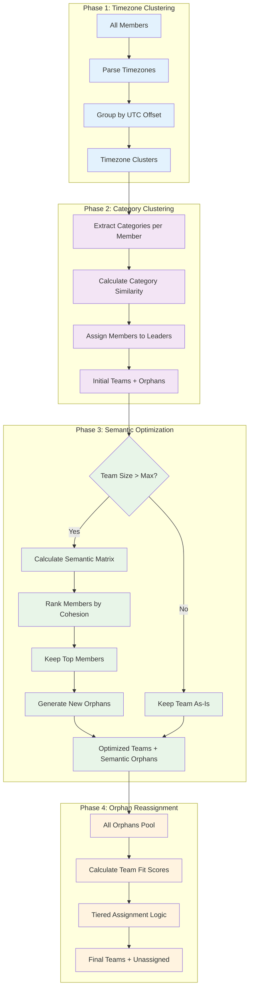
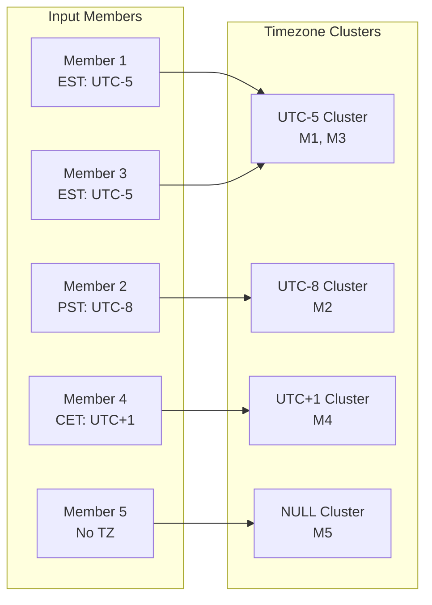
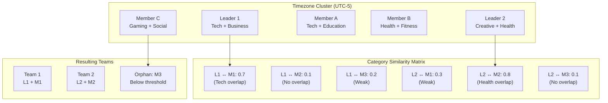
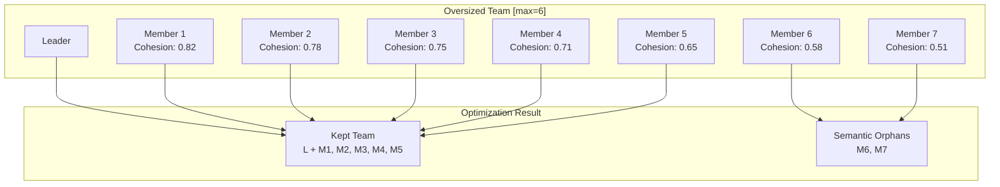
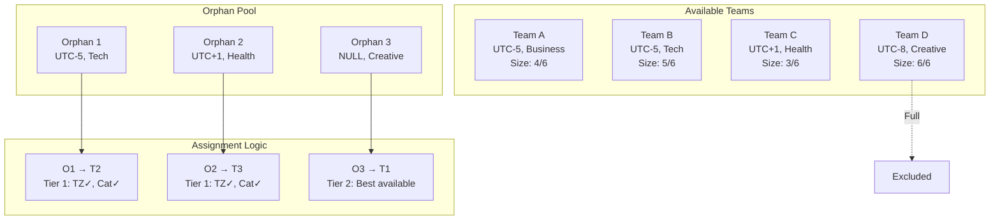

# Hierarchical Team Formation Algorithm - Deep Analysis

## Overview

The system implements a sophisticated **4-phase hierarchical clustering algorithm** that forms teams by progressively refining member groupings through multiple dimensions of compatibility. Unlike traditional hierarchical clustering that works with distance matrices, this algorithm uses a **constraint-based approach** with multiple scoring functions to optimize team composition.

## Theoretical Foundation

### Hierarchical Clustering Concepts

The algorithm follows **agglomerative hierarchical clustering** principles but with domain-specific constraints:

1. **Bottom-up Approach**: Starts with individual members and progressively groups them
2. **Multi-dimensional Distance Metrics**: Uses timezone compatibility, category similarity, and semantic matching
3. **Constraint-Based Clustering**: Enforces business rules (team size limits, leader requirements)
4. **Optimization-Based Refinement**: Uses semantic similarity to optimize oversized clusters

### Key Differences from Traditional Clustering

| Traditional Hierarchical | This Implementation |
|-------------------------|-------------------|
| Pure distance-based merging | Constraint-based with business rules |
| Single distance metric | Multi-dimensional scoring |
| Fixed cluster sizes | Dynamic with min/max constraints |
| No role differentiation | Leader-member hierarchy |

## Algorithm Architecture



## Detailed Phase Analysis

### Phase 1: Timezone Clustering

**Objective**: Group members by temporal compatibility for collaboration.

**Algorithm**:
```python
def _cluster_by_timezone(self, all_members: List[TeamMember]) -> Dict[Optional[float], List[TeamMember]]:
    timezone_clusters = defaultdict(list)
    for member in all_members:
        tz_string = member.profile_data.get("timezone")
        utc_offset = self.scorer.tz_processor.parse_to_utc_offset(tz_string) if tz_string else None
        timezone_clusters[utc_offset].append(member)
    return timezone_clusters
```

**Key Concepts**:
- **Hard Constraint**: Timezone compatibility is treated as a primary constraint
- **UTC Normalization**: All timezones converted to UTC offsets for consistent comparison
- **Null Handling**: Members without timezone data grouped separately



### Phase 2: Category Clustering

**Objective**: Form initial teams based on interest/skill domain similarity within timezone groups.

**Algorithm**:
```python
def _cluster_by_category(self, timezone_clusters: Dict[Optional[float], List[TeamMember]]) -> Tuple[List[Team], List[TeamMember]]:
    formed_teams, all_orphans = [], []

    for tz_offset, members in timezone_clusters.items():
        leaders = [m for m in members if m.is_leader()]
        if not leaders:
            all_orphans.extend(members)
            continue

        non_leaders = [m for m in members if not m.is_leader()]
        leader_cats = {l.user_id: self.scorer.get_member_categories(l.profile_data) for l in leaders}
        team_assignments = defaultdict(list, {l.user_id: [l] for l in leaders})

        for member in non_leaders:
            member_cats = self.scorer.get_member_categories(member.profile_data)
            leader_scores = {
                leader.user_id: self.scorer._calculate_categorical_score(member_cats, leader_cats[leader.user_id])
                for leader in leaders
            }

            best_leader_id, best_score = max(leader_scores.items(), key=lambda item: item[1])

            if best_score >= MIN_CATEGORY_SCORE_THRESHOLD:
                team_assignments[best_leader_id].append(member)
            else:
                all_orphans.append(member)
```

**Key Concepts**:

1. **Leader-Centric Clustering**: Teams form around leaders as cluster centroids
2. **Category Similarity Scoring**: Uses Jaccard-like similarity with domain weighting
3. **Threshold-Based Assignment**: Members must meet minimum compatibility threshold
4. **Orphan Generation**: Members below threshold become orphans for later reassignment

**Category Scoring Formula**:
```
shared_sub_score = |categories1 ∩ categories2| / min(|categories1|, |categories2|)
shared_dom_score = |domains1 ∩ domains2| / min(|domains1|, |domains2|)
final_score = 0.6 × shared_sub_score + 0.4 × shared_dom_score
```



### Phase 3: Semantic Optimization

**Objective**: Optimize oversized teams using deep semantic similarity analysis.

**Algorithm**:
```python
async def _optimize_oversized_team(self, team: Team) -> Tuple[Team, List[TeamMember]]:
    members = list(team.members.values())
    size = len(members)
    scores = np.zeros((size, size))

    # Build pairwise semantic similarity matrix
    for i in range(size):
        for j in range(i + 1, size):
            score = await self.scorer.calculate_semantic_compatibility(
                members[i].profile_data, members[j].profile_data
            )
            scores[i, j] = scores[j, i] = score

    # Calculate average cohesion score for each member
    avg_scores = {members[i].user_id: np.mean(scores[i]) for i in range(size)}

    leaders = [m for m in members if m.is_leader()]
    non_leaders = sorted([m for m in members if not m.is_leader()],
                        key=lambda m: avg_scores[m.user_id], reverse=True)

    # Keep leaders + top cohesive members
    slots_for_members = self.config.max_team_size - len(leaders)
    kept_members = leaders + non_leaders[:slots_for_members]
    orphans = non_leaders[slots_for_members:]

    return team, orphans
```

**Semantic Similarity Calculation**:

1. **SBERT Embeddings**: Goals and habits converted to sentence embeddings
2. **Cosine Similarity**: Measures semantic distance between embeddings
3. **Bonus System**: Rewards high-similarity pairs with additional scoring
4. **Cohesion Ranking**: Members ranked by average similarity to team

**Similarity Matrix Visualization**:



### Phase 4: Orphan Reassignment

**Objective**: Reassign all orphans using tiered compatibility logic.

**Algorithm**:
```python
def _reassign_orphans(self, orphans: List[TeamMember], teams: List[Team]) -> Tuple[List[Team], List[TeamMember]]:
    unassigned = []

    for orphan in orphans:
        candidate_teams = []
        for team in teams:
            if len(team.members) >= self.config.max_team_size:
                continue

            team_leaders = [vars(m) for m in team.get_leaders()]
            if not team_leaders:
                continue

            fit_scores = self.scorer.calculate_member_team_fit(orphan.profile_data, team_leaders)
            candidate_teams.append({'team': team, 'size': len(team.members), **fit_scores})

        if not candidate_teams:
            unassigned.append(orphan)
            continue

        # Tier 1: Good timezone fit
        primary_candidates = [c for c in candidate_teams
                            if c['tz_score'] >= MIN_TIMEZONE_SCORE_THRESHOLD]

        if primary_candidates:
            best_team = max(primary_candidates,
                          key=lambda x: (x['cat_score'], -x['size']))['team']
        # Tier 2: Best available timezone fit
        else:
            best_team = max(candidate_teams,
                          key=lambda x: (x['tz_score'], x['cat_score'], -x['size']))['team']

        best_team.members[orphan.user_id] = orphan

    return teams, unassigned
```

**Tiered Assignment Logic**:

1. **Tier 1 (Preferred)**: Teams with good timezone compatibility (≥ threshold)
   - Sort by: Category score (desc) → Team size (asc)
2. **Tier 2 (Fallback)**: Any available team
   - Sort by: Timezone score (desc) → Category score (desc) → Team size (asc)



## Algorithmic Parameters

### Configuration Constants

| Parameter | Value | Purpose |
|-----------|-------|---------|
| `MIN_CATEGORY_SCORE_THRESHOLD` | 0.1 | Minimum category similarity for assignment |
| `MIN_TIMEZONE_SCORE_THRESHOLD` | 0.55 | Minimum timezone compatibility for Tier 1 |
| `PERFECT_MATCH_THRESHOLD` | 0.95 |Semantic similarity bonus threshold |
| `PERFECT_MATCH_BONUS` | 0.25 | Bonus for perfect semantic matches |
| `MID_MATCH_THRESHOLD_LOW` | 0.4 | Lower bound for mid-range matches |
| `MID_MATCH_THRESHOLD_HIGH` | 0.6 | Upper bound for mid-range matches |
| `MID_MATCH_BONUS_INCREMENT` | 0.01 | Incremental bonus per mid-range match |
| `MID_MATCH_BONUS_CAP` | 0.05 | Maximum total mid-range bonus |
| `max_team_size` | 12 | Maximum members per team |

### Scoring Functions

#### Timezone Compatibility
```python
def calculate_compatibility(self, offset1: Optional[float], offset2: Optional[float]) -> float:
    if offset1 is None or offset2 is None:
        return 0.5  # Neutral score for unknown timezones

    time_diff = abs(offset1 - offset2)
    if time_diff <= 3:      # Same/adjacent zones
        return 1.0
    elif time_diff <= 6:    # Manageable difference
        return 0.7
    elif time_diff <= 9:    # Difficult but possible
        return 0.4
    else:                   # Very difficult
        return 0.1
```

#### Category Similarity
```python
def _calculate_categorical_score(self, categories1: Set[str], categories2: Set[str]) -> float:
    if not categories1 or not categories2:
        return 0.0

    domains1 = {cat.split(':')[0] for cat in categories1}
    domains2 = {cat.split(':')[0] for cat in categories2}

    # Sub-category overlap (more specific)
    shared_sub_score = len(categories1 & categories2) / min(len(categories1), len(categories2))

    # Domain overlap (broader)
    shared_dom_score = len(domains1 & domains2) / min(len(domains1), len(domains2))

    # Weighted combination favoring specificity
    return (0.6 * shared_sub_score) + (0.4 * shared_dom_score)
```

#### Semantic Compatibility
```python
async def calculate_semantic_compatibility(self, profile1: Dict, profile2: Dict) -> float:
    goals1, goals2 = profile1.get("goals", []), profile2.get("goals", [])
    habits1, habits2 = profile1.get("habits", []), profile2.get("habits", [])

    scores, weights = [], []

    if goals1 and goals2:
        goals_matrix = await self.ai_handler.compare_goals(goals1, goals2)
        scores.append(self._apply_similarity_bonuses(goals_matrix))
        weights.append(1.0)

    if habits1 and habits2:
        habits_matrix = await self.ai_handler.compare_habits(habits1, habits2)
        scores.append(self._apply_similarity_bonuses(habits_matrix))
        weights.append(1.0)

    if not scores:
        return 0.0

    return np.average(scores, weights=weights)
```

## Algorithm Complexity Analysis

### Time Complexity

| Phase | Operation | Complexity | Explanation |
|-------|-----------|------------|-------------|
| 1 | Timezone Clustering | O(n) | Single pass through members |
| 2 | Category Clustering | O(n × l) | n members, l leaders per timezone |
| 3 | Semantic Optimization | O(k³) | k = oversized team size, pairwise comparison |
| 4 | Orphan Reassignment | O(o × t) | o orphans, t teams |

**Overall Complexity**: O(n × l + Σk³ + o × t)

### Space Complexity

- **Member Storage**: O(n) for all members
- **Similarity Matrices**: O(k²) per oversized team
- **Category Mappings**: O(n × c) where c = avg categories per member

## Algorithmic Strengths and Limitations

### Strengths

1. **Multi-dimensional Optimization**: Considers timezone, interests, and semantic compatibility
2. **Hierarchical Refinement**: Progressive optimization through multiple phases
3. **Constraint Handling**: Respects business rules (team sizes, leader requirements)
4. **Semantic Understanding**: Uses state-of-the-art NLP for deep compatibility analysis
5. **Graceful Degradation**: Handles edge cases with tiered fallback logic

### Limitations

1. **Computational Complexity**: Semantic analysis is computationally expensive
2. **Parameter Sensitivity**: Performance depends on threshold tuning
3. **Leader Dependency**: Requires sufficient leaders for effective clustering
4. **Cold Start Problem**: New members without rich profiles may be poorly matched
5. **Local Optima**: Greedy assignment may miss globally optimal solutions

## Real-World Performance Considerations

### Scalability Factors

- **Member Count**: Algorithm scales reasonably to ~100-200 members
- **Semantic Analysis**: Most expensive operation, requires careful resource management
- **Database Operations**: Efficient batch operations minimize I/O overhead

### Optimization Strategies

1. **Lazy Loading**: SBERT model loaded only when needed
2. **Async Processing**: Non-blocking operations for Discord responsiveness
3. **Caching**: Global model cache prevents redundant loading
4. **Batch Operations**: Minimize database round trips

This hierarchical clustering approach represents a sophisticated solution to the multi-constraint optimization problem of team formation, balancing multiple compatibility dimensions while respecting practical constraints and providing robust fallback mechanisms for edge cases.
